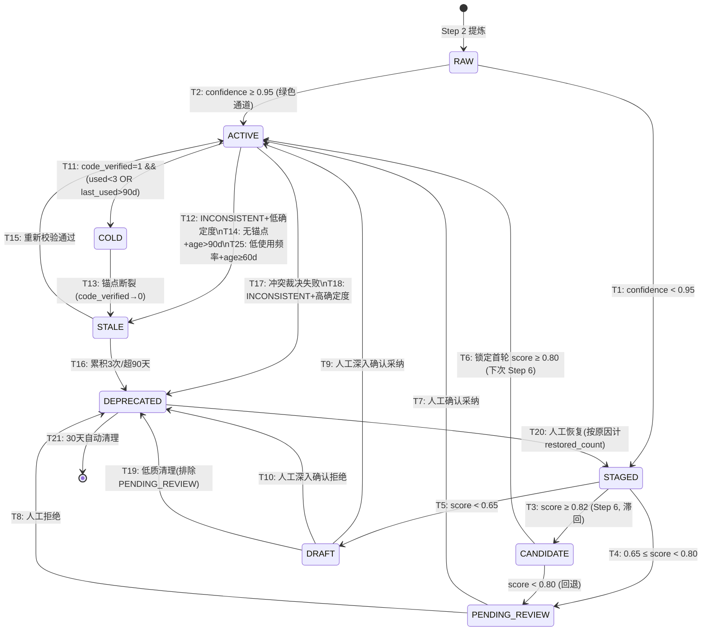

# devContextMemo 深度设计：知识条目晋升生命周期

> **触发**：用户要求「先定义晋升生命周期」，后经审核发现 11 项漏洞，全面修补
> **定位**：将分散在多个文档中的晋升规则、修剪规则、冲突处理整合为统一的 7 阶段生命周期模型
> **日期**：2026-06-16
> **版本**：V2.1（2026-06-17 晋升公式修宪：freshness → calibration_recency，权重 0.70/0.15/0.15）
> **关联文档**：
> - `devContextMemo-目录划分-晋升规则-修改检测-深度调研-V1.0.md`（三目录 + 晋升公式 + 冷知识保护）
> - `devContextMemo-知识更新-冲突检测-冲突解决-深度设计-V1.0.md`（7 条更新路径 + 跨条目矛盾）
> - `devContextMemo-流水线-Step5-写入层-细化设计-V1.0.md`（绿色通道 + staging/ 写入）
> - `devContextMemo-流水线-Step6-巩固层-细化设计-V1.0.md`（晋升触发 + 修剪规则）
> - `devContextMemo-晋升生命周期-审核报告-V1.0.md`（V14-V24 漏洞详情）

---

## 〇、设计原则

| # | 原则 | 含义 |
|:--:|------|------|
| 1 | **物理目录 = 3，逻辑阶段 = 7** | 人眼只需识别 staging/ / knowledge/ / deprecated/ 三个目录，但系统内部追踪 7 个更细的阶段 |
| 2 | **晋升看质量，修剪看使用频率** | 晋升公式含 confidence + calibration_recency + anchor_bonus。`used_count` 只在修剪中起作用 |
| 3 | **代码锚点是加分项，不是门槛** | `code_verified=1` 加 0.15 分（V2.1 调整），`code_verified=0` 不加分——**不对无锚点知识关门**（V15 修补） |
| 4 | **弱审核、默认生效** | 绿色通道（confidence ≥ 0.95）直接进入 knowledge/；事后回溯可降级 |
| 5 | **有升有降，知识会过时** | 明确的下降路径覆盖所有状态组合（V17 修补） |
| 6 | **滞回防抖** | CANDIDATE 阈值 0.82（比 PENDING_REVIEW 上限 0.80 高 0.02），杜绝震荡（V21 修补） |
| 7 | **人工审核权不可被自动剥夺** | 系统不会自动清理 PENDING_REVIEW 条目（V16 修补） |

### V2.0 相对于 V1.0 的核心变更

| 漏洞 | 变更点 | 影响 |
|:---:|------|------|
| V14 | 删除 T14（COLD→DEPRECATED），槽位用于新 T14（无锚点时间衰减） | 消除幻影跃迁 |
| V15 | 晋升公式重构：code_verified 从 0.30 权重→0.15 加分，无锚点 max 从 0.70→0.85 | 无锚点知识可达 CANDIDATE |
| V16 | T19 排除 PENDING_REVIEW | 人工审核权不再被自动剥夺 |
| V17 | 新增 T14：ACTIVE(code_verified=0, no_change, age>90d)→STALE | 填补僵尸知识下降路径 |
| V18 | T12/T18 引入 certainty 字段分流 | INCONSISTENT 处理一致化 |
| V19 | STALE 置信度折扣对齐 V12 累积模型（×0.80→×0.60→×0.40） | 消除与保真体系的矛盾 |
| V20 | STALE 细化为 3 个子阶段（suspicious/confirmed/deep） | suspected_stale 正式建模 |
| V21 | CANDIDATE 引入滞回（score≥0.82 进，score<0.80 出） | 杜绝状态震荡 |
| V22 | 文档明确绿色通道与评分公式是两套独立决策 | 消除语义混淆 |
| V23 | CANDIDATE 二次确认锁定首轮分数 | 排除 time_decay 对确认的干扰 |
| V24 | T20 恢复时追踪被废弃原因，冲突裁决恢复不计 restored_count | 恢复语义精准化 |

---

## 一、7 个逻辑阶段定义

```
┌─────────────────────────────────────────────────────────────────────┐
│                    知识条目晋升生命周期（7 阶段）                      │
│                                                                     │
│  ┌──────────┐    ┌──────────┐    ┌──────────┐    ┌──────────┐      │
│  │   RAW    │───→│  STAGED  │───→│CANDIDATE │───→│  ACTIVE  │      │
│  │ (暂态)   │    │ staging/ │    │ staging/ │    │knowledge/│      │
│  └──────────┘    └────┬─────┘    └────┬─────┘    └────┬─────┘      │
│                       │              │                │            │
│                       ▼              ▼                ├──────────┐  │
│                  ┌──────────┐  ┌──────────┐          ▼          ▼  │
│                  │PENDING_  │  │  DRAFT   │    ┌──────────┐ ┌────┐ │
│                  │ REVIEW   │  │ staging/ │    │   COLD   │ │STALE│ │
│                  │ staging/ │  └────┬─────┘    │knowledge/│ │know │ │
│                  └────┬─────┘       │          └────┬─────┘ └──┬─┘ │
│                       │             │               │          │    │
│                       │             │               ▼          │    │
│                       │             │        ┌──────────┐      │    │
│                       │             │        │  STALE   │◄─────┘    │
│                       │             │        │knowledge/│           │
│                       │             │        └────┬─────┘           │
│                       │             │             │                 │
│                       ▼             ▼             ▼                 │
│                  ┌──────────────────────────────────────┐          │
│                  │            DEPRECATED                │          │
│                  │           deprecated/                │          │
│                  └──────────────────────────────────────┘          │
└─────────────────────────────────────────────────────────────────────┘
```

### 阶段速查表

| # | 阶段 | 物理位置 | 含义 | 人需要做什么 | 系统自动做什么 |
|:--:|------|---------|------|------------|--------------|
| 0 | **RAW** | （内存，未落盘） | Step 2 刚提炼出，尚未写入任何位置 | 无 | Step 2→Step 5 流水线自动传递 |
| 1 | **STAGED** | `staging/` | 已写入文件，等待首次评估（score 尚未计算） | 无（首次评估前是纯自动阶段） | Step 5 写入完成，等待 Step 6 评估 |
| 2 | **PENDING_REVIEW** | `staging/` | Step 6 评估后：0.65 ≤ score < 0.80，建议人审核 | **人工审核**（核心使用场景）| 自动排序（按 score）、自动标记相似条目 |
| 3 | **CANDIDATE** | `staging/` | Step 6 评估后：score ≥ 0.82（滞回阈值），建议晋升 | 可选确认（不确认也会被下次 Step 6 自动晋升） | 下次 Step 6 自动移动到 knowledge/ |
| 4 | **DRAFT** | `staging/` | Step 6 评估后：score < 0.65，需人工深入确认 | **人工深入确认**（可能需编辑内容） | 标记高风险，优先展示 |
| 5 | **ACTIVE** | `knowledge/` | 活跃使用的可信知识 | 偶尔浏览、修改 | 自动注入上下文、自动校准 |
| 6 | **COLD** | `knowledge/` | 正确但低频使用的知识（code_verified=1 保护中） | 无 | 不修剪、不衰减，保留在 knowledge/ |
| 7 | **STALE** | `knowledge/` | 关联代码可能已变更，或长时间未被验证（含 3 个子阶段） | 重新验证或确认废弃 | confidence 累积折扣，提示待校验 |
| 8 | **DEPRECATED** | `deprecated/` | 知识已失效（被取代、校验失败、或被否决），记录废弃原因 | 可恢复（T20）或确认删除 | 自动归档、30 天后清理（冲突裁决恢复不计 restored_count） |

### STALE 子阶段（V20 修补）

STALE 不再是单一状态，而是一个渐进恶化的过程：

| 子阶段 | 触发 | confidence 折扣 | stale_check_count | 含义 |
|:------:|------|:---------------:|:-----------------:|------|
| **suspicious** | Step 3 检测到 LOW certainty INCONSISTENT（T12），或长期未验证（T14） | ×0.80 | 1 | 轻微可疑，系统提示但不过度反应 |
| **confirmed** | 再次检测到 INCONSISTENT，或 suspicious 持续 30 天未恢复 | ×0.60 | 2 | 确认有问题，用户应关注 |
| **deep** | 第三次检测到 INCONSISTENT，或 confirmed 持续 60 天未恢复 | ×0.40 | 3 | 严重可疑，即将废弃 |

子阶段跃迁由 Step 3（校验）和 Step 6（修剪扫描）共同驱动，用户在任意子阶段都可以手动恢复（T15）或手动废弃。

---

## 二、跃迁规则（V2.0 完整版）

### 2.1 跃迁总表

| # | 从 → 到 | 触发条件 | 触发点 | 自动化 | 动作 |
|:--:|---------|---------|:------:|:-----:|------|
| T1 | RAW → STAGED | confidence < 0.95（非绿色通道） | Step 5 写入 | 🤖 自动 | 写入 `staging/YYYYMMDD-名称.md` |
| T2 | RAW → ACTIVE | confidence ≥ 0.95（绿色通道） | Step 5 写入 | 🤖 自动 | 直接写入 `knowledge/<domain>/名称.md` |
| T3 | STAGED → CANDIDATE | promotion_score ≥ 0.82（滞回阈值） | Step 6 巩固 | 🤖 自动 | 更新 DB status='candidate' |
| T4 | STAGED → PENDING_REVIEW | 0.65 ≤ promotion_score < 0.80 | Step 6 巩固 | 🤖 自动 | 更新 DB status='pending_review'，提示用户 |
| T5 | STAGED → DRAFT | promotion_score < 0.65 | Step 6 巩固 | 🤖 自动 | 更新 DB status='draft'，标记高风险 |
| T6 | CANDIDATE → ACTIVE | 下次 Step 6 确认（锁定首轮 score ≥ 0.80） | Step 6 巩固 | 🤖 自动 | 移动文件至 `knowledge/<domain>/`，去日期前缀 |
| T7 | PENDING_REVIEW → ACTIVE | 人工确认采纳 | `dev review` | 👤 人工 | 移动文件至 `knowledge/<domain>/` |
| T8 | PENDING_REVIEW → DEPRECATED | 人工拒绝 | `dev review` | 👤 人工 | 移动文件至 `deprecated/`，标记原因='human_rejected' |
| T9 | DRAFT → ACTIVE | 人工深入确认后采纳 | `dev review` | 👤 人工 | 移动文件至 `knowledge/<domain>/` |
| T10 | DRAFT → DEPRECATED | 人工深入确认后拒绝 | `dev review` | 👤 人工 | 移动文件至 `deprecated/`，标记原因='human_rejected' |
| T11 | ACTIVE → COLD | used_count 低 BUT code_verified=1（V1.1 修剪规则已补：used<3 OR last_used>90d） | 修剪扫描 | 🤖 自动 | 标记 cold，保护不修剪 |
| T12 | ACTIVE → STALE(suspicious) | Step 3 检测到 **LOW certainty** INCONSISTENT | Step 3 校验 | 🤖 自动 | code_verified=0，confidence×0.80，标记待校验 |
| T13 | COLD → STALE(suspicious) | code_verified 变为 0（冷知识的锚点断裂） | Step 3 校验 | 🤖 自动 | 同 T12，进入 STALE(suspicious) |
| T14 | ACTIVE → STALE(suspicious) | code_verified=0 AND 无代码变更 AND age > 90 天 | 修剪扫描 | 🤖 自动 | confidence×0.80，flag='unverified_for_long' |
| T25 | ACTIVE → STALE(suspicious) | code_verified=0 AND prune_priority≥0.70 AND age≥60d（V1.1 修剪规则） | 修剪扫描 | 🤖 自动 | confidence×0.80，flag='low_usage' |
| T15 | STALE(any) → ACTIVE | 重新校验通过（code_verified 恢复为 1） | Step 3 校验 | 🤖 自动 | confidence 恢复，阶段回 ACTIVE |
| T16 | STALE(deep) → DEPRECATED | stale_check_count ≥ 3 OR (stale_check_count≥1 AND age_in_stale>90d) | 修剪扫描 | 🤖 自动 | 移动至 deprecated/，标记原因='verification_failed' |
| T17 | ACTIVE → DEPRECATED | 冲突裁决：新旧矛盾，新知识胜出 | Step 4 冲突 | 🤖 自动 | 旧知识 → deprecated/，superseded_by 链，标记原因='superseded' |
| T18 | ACTIVE → DEPRECATED | Step 3 检测到 **HIGH certainty** INCONSISTENT | Step 3 校验 | 🤖 自动 | 移动至 deprecated/，标记原因='direct_contradiction' |
| T19 | DRAFT → DEPRECATED | confidence < 0.6 AND age > 30d（V1.1 修剪规则：移除冗余 used_count=0） | 修剪扫描 | 🤖 自动 | 移动至 deprecated/，标记原因='low_quality' |
| T20 | DEPRECATED → STAGED | 人工恢复 | `dev review` | 👤 人工 | 移动回 staging/，重置评估，根据 deprecation_reason 决定是否计入 restored_count |
| T21 | 任意 → 删除 | DEPRECATED 后 30 天无恢复（low_quality/stale_draft 缩短至 14d；V1.1 修剪规则差异化窗口） | 定时清理 | 🤖 自动 | 物理删除文件 + DB 记录 |

### 2.2 跃迁条件详解

#### T1/T2：RAW → STAGED / ACTIVE（写入分流）

```
if candidate.confidence ≥ 0.95:
    → ACTIVE（绿色通道，直接进 knowledge/）
else:
    → STAGED（进 staging/，等待 Step 6 评估）
```

> **设计依据**：「弱审核、默认生效」。0.95 意味着几乎确定正确，跳过人工审核是合理的。
>
> **与评分公式的关系（V22 明确）**：绿色通道和晋升评分是两套独立决策体系——
> - 绿色通道（T2）是 **Step 5 写入时的单因子判断**（只看 confidence），用于快速通路
> - 晋升评分（T3/T4/T5）是 **Step 6 的多因子综合评估**（confidence + calibration_recency + anchor_bonus），用于 staging/ 的分流
> - 绿色通道通过后，知识直接进入 ACTIVE，不再经过评分公式。进入 ACTIVE 后受 V17 的 T14 保护（无锚点知识 90 天后自动进入 STALE）

#### T3/T4/T5：STAGED → CANDIDATE / PENDING_REVIEW / DRAFT（首次评估）

**晋升评分公式（V2.1 修正 — 2026-06-17 双重验证确认）**：

> **V2.1 变更**：`freshness × 0.30`（按创建时间衰减）违反诉求②「无时间衰减」承诺，改为 `calibration_recency × 0.15`（按上次校准时间）。
> confidence 权重从 0.50 提升到 0.70——知识对不对比知识新不新重要得多。
> anchor_bonus 从 0.20 降至 0.15（关联权重调整）。

```
promotion_score = confidence × 0.70 + anchor_bonus × 0.15 + calibration_recency × 0.15

anchor_bonus:
    if code_verified == 1: anchor_bonus = 1.0
    else: anchor_bonus = 0

calibration_recency = 1.0 - min(days_since_last_calibration / 180, 1.0)
```

**公式反算验证**：

| 场景 | confidence | code_verified | cal_recency | score | 可达？|
|------|:---------:|:------------:|:-----------:|:-----:|:-----:|
| 无锚点最优 | 1.00 | 0 | 1.00 | 0.85 | CANDIDATE ✅ |
| 无锚点高质 | 0.92 | 0 | 1.00 | 0.79 | PENDING_REVIEW |
| 无锚点中质 | 0.85 | 0 | 0.95 | 0.74 | PENDING_REVIEW |
| 有锚点中质 | 0.70 | 1 | 1.00 | **0.85** | CANDIDATE ✅ |
| 有锚点低质 | 0.55 | 1 | 1.00 | 0.70 | PENDING_REVIEW |
| 有锚点+久未校准 | 0.85 | 1 | 0.50 | 0.77 | PENDING_REVIEW |
| 昨天校准的旧知识 | 0.92 | 1 | 0.99 | **0.94** | CANDIDATE ✅ |

> **关键验证**：最后一行——创建 180 天前但昨天刚校准的知识 → score = 0.94（比一天前创建但从未校准的无锚点知识 0.79 高），符合诉求②「正确知识永远有效，不因时间新旧影响排序」。

**分流逻辑（V21 滞回修补）**：

```
if promotion_score ≥ 0.82:         # 滞回上限（比 PENDING_REVIEW 上限高 0.02）
    → CANDIDATE（建议晋升）
elif promotion_score ≥ 0.65:
    → PENDING_REVIEW（建议人工审核）
else:
    → DRAFT（需人工深入确认）
```

**退出 CANDIDATE——滞回下限**：
```
if CANDIDATE 中，重新计算 score < 0.80:
    → PENDING_REVIEW（回退）
```

> **滞回设计（V21）**：进 CANDIDATE 门槛 0.82，出 CANDIDATE 门槛 0.80。这个 0.02 缓冲区杜绝了 score 在 0.80 附近摇摆时的状态震荡。
>
> **无锚点知识的晋升（V15）**：`anchor_bonus` 是加分项而非门槛项。无锚点知识的 max score = 0.80，可以进入 PENDING_REVIEW（0.65-0.80），但不能自动晋升到 CANDIDATE（需要 0.82）。这意味着：**无锚点的高质量知识会被引导到人工审核通道，而不会被永远卡住**。

#### T6：CANDIDATE → ACTIVE（自动晋升 — V23 修补）

```
上次 Step 6 标记为 CANDIDATE（score ≥ 0.82）
+ 本次 Step 6 用【锁定的首轮 score】（忽略 time_decay 变化）检查 ≥ 0.80
→ 移动文件至 knowledge/<domain>/
```

> **锁定分数机制（V23）**：CANDIDATE 的二次确认使用首轮 score，忽略期间 time_decay 的变化。这确保了双重确认是真正的「防噪声」，而非隐藏的条件收紧。
>
> **示例**：首轮 score=0.83（含 time_decay=0）。7 天后如果重新计算，time_decay=0.039 会让 score 降到 0.812。但使用锁定分数，仍然按 0.83 判定——通过。

#### T7/T8/T9/T10：PENDING_REVIEW / DRAFT → ACTIVE / DEPRECATED（人工裁决）

```
用户运行 dev review → 看到待审列表 → 逐条决定：
  - 采纳 → ACTIVE（移动到 knowledge/）
  - 拒绝 → DEPRECATED（移动到 deprecated/，标记 reason='human_rejected'）
```

> **DRAFT 的特殊性**：评分 < 0.65 意味着 confidence 低或 code_verified=0，人工审核时可能还需要编辑内容（不是简单的是/否判断）。

#### T11：ACTIVE → COLD（休眠保护 — V35 修补）

```
条件: code_verified == 1 AND (used_count < 3 OR last_used_at > 90d 或 NULL)
动作: 标记 cold，不修剪、不衰减，保留在 knowledge/
```

> **设计依据**：冷但正确的知识（如支付回滚预案）不应该被误删。`code_verified=1` 是保护伞。
>
> **V1.1 修剪规则修补（V35）**：原先只用 `used_count < 3` 作为条件，导致 used_count=15 但 last_used_at=155d 前的「热后冷」知识永远 ACTIVE、永远不进 COLD。修补后增加 `last_used_at > 90d` 条件——即使 used_count 高，如果 90 天内无新使用，也进入 COLD 休眠保护。`last_used_at IS NULL` 处理从未被使用的知识。

#### T12/T18：ACTIVE → STALE(suspicious) / DEPRECATED（V18 修补 — certainty 分流）

```
Step 3 检测到关联代码变更

LLM 输出两个维度:
  - verdict: CONSISTENT / INCONSISTENT / UNCERTAIN
  - certainty: 0.0-1.0（LLM 对自己判断的置信度）

分流规则:
  CONSISTENT              → code_verified 保持 1，不受影响
  UNCERTAIN               → 标记 suspected_stale，不改变阶段（同 V11 修补）
  INCONSISTENT + certainty ≥ 0.80  → T18: ACTIVE → DEPRECATED
  INCONSISTENT + certainty < 0.80  → T12: ACTIVE → STALE(suspicious)
```

> **设计依据（V18）**：引入 `certainty` 字段解决 T12 和 T18 同为 INCONSISTENT 却走向不同终点的矛盾。高确定度 + 不一致 = 直接废弃（不需要缓冲期）；低确定度 + 不一致 = 标记可疑给缓冲期。
>
> **METAMON 参考**：LLM 判断代码-文档一致性的 accuracy 约 0.72。当 certainty<0.80 时，标记 STALE 而非直接废弃，给人工介入留空间。

#### T13：COLD → STALE(suspicious)（锚点断裂）

```
触发: COLD 条目的关联代码变更（Step 3 检测到 entry_point 修改）
检测: 同 T12 逻辑
结果: 进入 STALE(suspicious)（而不是直接废弃——虽然它低频，但曾经被 code_verified 保护过，应有 90 天缓冲）
```

> **V2.0 变更**：原 T14（COLD→DEPRECATED）已删除。COLD 条目失去锚点后走 T13→STALE→T16 的完整 90 天缓冲路径，不再有「30 天快速通道」——因为 COLD 本身要求 code_verified=1（已证明过质量），失去锚点后不应该比 ACTIVE 条目更脆弱。

#### T14：ACTIVE → STALE(suspicious)（无锚点长时间未验证 — V17 修补）

```
条件: code_verified == 0  AND  无代码变更触发 Step 3  AND  age > 90 天
动作: 进入 STALE(suspicious)，confidence × 0.80，flag = 'unverified_for_long'
```

> **设计依据（V17）**：填补 ACTIVE(code_verified=0, used_count<3) 的下降路径。没有代码锚点的知识，代码变更无法触发重新校验，需要一个时间驱动的「温和提醒」机制。
>
> **与 T12 的区别**：T12 是被外部事件（代码变更）触发的，T14 是被内部时钟（时间流逝）触发的。T14 的惩罚比 T12 更温和——只是标记 suspicious，不改变 code_verified（它本来就=0），仅 confidence 打折 0.80。
>
> **示例**：「团队决定使用 MySQL 8.0 InnoDB」——无代码锚点，3 个月后，系统温和提醒「这条架构决策 90 天未验证，是否仍有效？」

#### T15：STALE(any) → ACTIVE（恢复）

```
触发: Step 3 重新校验通过（关联代码变更后，LLM 再次判断为 CONSISTENT）
     或人工确认知识仍然正确
动作: code_verified = 1，confidence 恢复原值，stale_check_count 重置为 0
```

#### T16：STALE(deep) → DEPRECATED（V19 累积折扣修补）

```
触发的任一条件:
  1. stale_check_count ≥ 3（累积 3 次不一致判定）
  2. 进入 STALE 超过 90 天，且仍未恢复

置信度累积折扣（对齐 V12 设计）:
  suspicious (count=1)  → confidence × 0.80
  confirmed  (count=2)  → confidence × 0.60
  deep       (count=3)  → confidence × 0.40 → 触发 T16

动作: 移动至 deprecated/，标记原因='verification_failed'
```

> **V2.0 变更（V19）**：从单次折扣 ×0.9 改为累积折扣 ×0.80→×0.60→×0.40，对齐 `devContextMemo-知识更新-冲突检测-冲突解决-深度设计-V1.0.md` 中的 V12 修补。
>
> **90 天缓冲**：STALE 在 knowledge/ 中有 90 天时间等待恢复，因为它在 ACTIVE 阶段曾证明过自己的价值。COLD→STALE 的条目也有同样的 90 天缓冲（通过 T13→STALE→T16 路径），不再有歧路的 30 天快速通道。

#### T17：ACTIVE → DEPRECATED（冲突裁决）

```
Step 4 检测到新知识与已有 ACTIVE 知识矛盾
冲突裁决:
  - 新知识 confidence 更高 → ACTIVE 降级为 DEPRECATED，新知识取代
  - 旧知识 confidence 更高 → 新知识降级（不进 knowledge/）
  - confidence 接近 → 两条都保留，标记 conflict_with，等人工裁决

废弃原因: deprecation_reason = 'superseded'
```

#### T18：ACTIVE → DEPRECATED（校验直接失败 — V18 修补）

```
Step 3 校验: INCONSISTENT AND certainty ≥ 0.80
→ 知识直接移到 deprecated/，标记原因='direct_contradiction'
→ 同时标记旧知识的 superseded_by 字段
```

> **V2.0 变更（V18）**：T18 仅在高确定度（certainty ≥ 0.80）时触发。低确定度走 T12→STALE。

#### T19：DRAFT → DEPRECATED（低质清理 — V16+V26 修补）

```
条件: confidence < 0.6 AND age > 30d
适用: 仅 DRAFT（已排除 PENDING_REVIEW）
动作: 移动至 deprecated/，标记原因='low_quality'
```

> **V2.0 变更（V16）**：T19 的适用范围从「任意 staging/」缩小为「仅 DRAFT」。PENDING_REVIEW 是系统建议人审的条目——人工审核权不可被系统自动剥夺。
>
> **V1.1 修剪规则修补（V26）**：移除 `used_count=0` 条件。staging/ 中的知识根本没有使用机会，used_count 永远为 0。条件冗余但不影响逻辑——移除只是让文档更精确。

#### T25：ACTIVE → STALE(suspicious)（使用频率修剪 — V1.1 修剪规则新增）

```
条件: code_verified=0 AND prune_priority ≥ 0.70 AND age ≥ 60d
动作: 进入 STALE(suspicious)，confidence × 0.80，flag='low_usage'

prune_priority = (1 - freshness) × 0.60 + (1 - used_count_normalized) × 0.40
```

> **与 T14 的关系（V27+V34）**：T14 先检查（age>90d），若命中则跳过 T25。T25 补充检查 T14 未命中的条目（age≥60d + prune_priority≥0.70）。当 used=0+age≥90d 时 T14 包揽；当 used≥1+age≥90d 时 T14 独享（prune_priority 不达标）。真正的互补在 used≥1 时成立。
>
> **60 天保护期（V25）**：新知识 age<60d 时即使 prune_priority≥0.70 也不触发 T25——给新知识足够的「被发现」窗口。

#### T20：DEPRECATED → STAGED（人工恢复 — V24 修补）

```
用户运行 dev review → 看到 deprecated/ 列表 → 选择恢复
动作: 移动回 staging/，重置 used_count=0，重新进入评估流程

restored_count 规则（V24 修补）:
  if deprecation_reason == 'superseded' (T17 冲突裁决):
      → 不计入 restored_count（知识可能是质量好的，只是 confidence 略低于新版本）
  else (T16/T18/T19 或人工拒绝):
      → 计入 restored_count
      → 连续 ≥ 2 次触发告警：
        「这条知识你已恢复 {n} 次，但系统判断它质量不过关——请编辑内容后再提交」
```

> **V2.0 变更（V24）**：区分废弃原因。被冲突裁决淘汰的知识（deprecation_reason='superseded'）在恢复时不计入 restored_count，因为它们可能只是因为 confidence 略低而败给新知识，不代表质量差。

#### T21：自动清理 — V1.1 修剪规则差异化窗口

```
条件: 处于 DEPRECATED 阶段 ≥ 30 天（low_quality / stale_draft 缩短至 14 天）
动作: 物理删除文件 + 软删除 DB 记录
```

---

## 三、状态机图（Mermaid — V2.0）



---

## 四、物理目录与逻辑阶段的映射

```
.devContextMemo/
│
├── staging/                        ← 阶段 1~4（STAGED / PENDING_REVIEW / CANDIDATE / DRAFT）
│   ├── 20260616-订单幂等校验方案.md    阶段: STAGED（刚写入，未评估）
│   ├── 20260615-限流策略设计.md        阶段: CANDIDATE（评分 0.85，下次晋升）
│   ├── 20260614-N+1查询规范.md         阶段: PENDING_REVIEW（评分 0.72，等人审）
│   └── 20260613-缓存策略.md            阶段: DRAFT（评分 0.58，需深入确认）
│
├── knowledge/                      ← 阶段 5~7（ACTIVE / COLD / STALE）
│   ├── 订单/
│   │   ├── 订单状态机设计.md           阶段: ACTIVE（评分 0.91，活跃使用）
│   │   └── 幂等校验方案.md             阶段: COLD（正确但低频，code_verified=1）
│   ├── 架构/
│   │   └── 微服务拆分原则.md           阶段: STALE(confirmed)（2次INCONSISTENT）
│   └── 支付/
│       └── 回调处理规范.md             阶段: ACTIVE（评分 0.87）
│
└── deprecated/                     ← 阶段 8（DEPRECATED）
    ├── 旧版缓存策略.md                 (被取代，reason='superseded')
    └── 单机限流方案.md                 (校验失败，reason='verification_failed')
```

**关键规则**：
- 同一个目录内的文件可能处于不同逻辑阶段（如 staging/ 里同时有 STAGED、CANDIDATE、PENDING_REVIEW、DRAFT）
- 阶段信息存储于 **DB `status` 字段 + `promotion_score` 字段**，不依赖文件系统
- STALE 的子阶段（suspicious/confirmed/deep）存储于 DB `stale_sub_phase` + `stale_check_count` 字段
- 人眼只需要知道「staging/ 需要我审」——至于哪个是 CANDIDATE 哪个是 DRAFT，由 `dev review` 命令按优先级排序展示

---

## 五、与流水线各 Step 的衔接

```
Step 2（提炼）            Step 5（写入）            Step 6（巩固）
    │                        │                        │
    │ 产出 candidate         │ 判断绿色通道             │ 计算 promotion_score
    │ confidence +          │                        │ 执行晋升 / 标记待审
    │ domain + content      │ T1: → staging/         │
    │                        │ T2: → knowledge/       │ T3~T6: 评估 + 晋升
    ▼                        ▼                        ▼
┌──────┐    Step 4     ┌──────────┐    Step 6    ┌──────────┐
│ RAW  │──────────────→│ STAGED   │──────────────→│ ACTIVE   │
│      │  去重 + 判别   │PENDING_R │  巩固评估     │ COLD     │
│      │  MERGE/UPDATE │ DRAFT    │              │ STALE    │
└──────┘    /NEW       │CANDIDATE │              │DEPRECATED│
                       └──────────┘              └──────────┘
                            ▲                        │
                            │      Step 3（验证）     │
                            │      代码变更检测        │
                            │      certainty +       │
                            │      CONSISTENT?       │
                            │                        │
                            └────────────────────────┘
                               T12: INCONSISTENT(低确定度)→STALE(suspicious)
                               T13: COLD 锚点断裂→STALE(suspicious)
                               T15: STALE→ACTIVE（重新校验通过）
                               T18: INCONSISTENT(高确定度)→DEPRECATED
```

| Step | 对生命周期的影响 | 可能触发的跃迁 |
|:----:|-----------------|:------------:|
| **Step 2（提炼）** | 产出 RAW 阶段候选 | 无（只是产出，不改变状态） |
| **Step 4（去重）** | 判断新候选与已有知识的关系 | T17（冲突裁决导致已有 ACTIVE → DEPRECATED） |
| **Step 5（写入）** | 落盘 + 绿色通道分流 | T1（→ STAGED）/ T2（→ ACTIVE） |
| **Step 6（巩固）** | 批量评估 + 晋升 + 修剪 + 时间衰减检查 | T3~T6、T14、T16、T19 |
| **Step 3（验证）** | 代码变更触发一致性检查（含 certainty 输出） | T12、T13、T15、T18 |
| **dev review** | 人工审核交互界面 | T7~T10、T20 |

---

## 六、边界情况处理（V2.0 更新）

### 6.1 绿色通道误判

> **场景**：confidence=0.95 的知识直接进了 knowledge/，但后来发现错误。

**处理**：
1. 该知识 code_verified=0 → 90 天后 T14 触发 → STALE(suspicious) → 用户或 Step 3 发现 → 降级
2. 或人工发现 → `dev review` → 手动降级到 DEPRECATED
3. T17/T18 冲突裁决/校验失败也可降级

### 6.2 CANDIDATE 滞回防抖（V21 已修补）

> **场景**：一次 Step 6 评分为 CANDIDATE（0.82+），下次 Step 6 评分降到 0.78。

**处理**：score < 0.80 回退到 PENDING_REVIEW。0.82 进 / 0.80 出形成 0.02 滞回带，杜绝震荡。

### 6.3 无锚点知识的晋升路径（V15 已修补，V2.1 公式更新）

> **场景**：「团队决定使用 MySQL 8.0 InnoDB」——confidence=0.92, code_verified=0。

**新公式下的轨迹**：
```
score = 0.92×0.70 + 0×0.15 + 1.0×0.15 = 0.794 → PENDING_REVIEW
用户审核采纳 → T7 → ACTIVE
进入 ACTIVE 后 code_verified=0 → 90 天后 T14 → STALE(suspicious)，温和提醒
```

与 V1.0 的对比：V1.0 中 score=0.66 被压在 PENDING_REVIEW。V2.1 中 score=0.79 稳定在 PENDING_REVIEW，公式中去掉了 freshness 对创建时间的惩罚，改为 calibration_recency 追踪校准时效。

### 6.4 冷知识的锚点断裂

> **场景**：一条 COLD 知识的 code_verified 突然变成 0（关联代码变更）。

**处理**：T13 → STALE(suspicious) → 90 天缓冲 → 有机会恢复。不会再走「30 天快速通道」（V14 已删除）。

### 6.5 人工恢复的知识被再次修剪（V24 已修补）

> **场景**：用户从 deprecated/ 恢复了知识到 staging/，但系统再次把它标记为 DEPRECATED。

**处理**：
- 如果是冲突裁决被淘汰的（deprecation_reason='superseded'）→ 不计 restored_count，给知识公平的重新评估机会
- 如果是质量/校验原因被淘汰的（verification_failed / low_quality / human_rejected）→ restored_count++ → 连续 ≥ 2 次 → 告警

### 6.6 知识同时命中多条跃迁规则

> **优先级**：冲突裁决（T17） > 校验失败高确定度（T18） > 修剪规则（T14/T16/T19/T25） > 晋升规则（T3~T6）

### 6.8 修剪规则 T14/T25 执行顺序（V1.1 修剪规则 — V27+V34）

> **场景**：一条知识 code_verified=0 + age=100d + used=0，T14 和 T25 同时满足触发条件。
>
> **处理**：T14 先检查（age>90d）→ 命中 → 标记 STALE(suspicious), flag='unverified_for_long'，跳过 T25。避免了 flag 归属冲突。

### 6.7 僵尸知识的时间衰减（V17 已修补）

> **场景**：一条绿色通道进来的知识（T2），code_verified=0，项目长期稳定无人调用。

**新路径**：age>90 天 → T14 → STALE(suspicious)，confidence×0.80。90 天后如果仍未恢复 → T16 → DEPRECATED。最长生命周期约 180 天（90 + 90）。

---

## 七、V2.0 修补验证：端到端场景重走

### 场景 1（重走）：架构决策知识（V15 验证，V2.1 公式更新）

```
场景: 团队决定使用 MySQL 8.0 InnoDB
confidence=0.92, code_verified=0

✅ V2.1 公式: score = 0.92×0.70 + 0×0.15 + 1.0×0.15 = 0.794 → PENDING_REVIEW
   用户审核采纳 → ACTIVE
   90 天后 → T14 → STALE(suspicious)，温和提醒
   （calibration_recency 追踪校准时效，不惩罚创建时间——符合诉求②）
```

### 场景 2（重走）：新手用户首次使用（V16 验证）

```
✅ V2.0: PENDING_REVIEW 条目不再被 T19 自动清理
   用户即使延迟 60 天才审，条目仍在 staging/ 中等候
   最多因 time_decay 分数微降（不影响 PENDING_REVIEW 状态）
```

### 场景 5（重走）：编码规范多条目分阶段（V15+V16 验证）

```
规范 A: confidence=0.88, code_verified=0 → score=0.74 → PENDING_REVIEW ✅
规范 B: confidence=0.82, code_verified=0 → score=0.71 → PENDING_REVIEW ✅
规范 C: confidence=0.91, code_verified=1 → score=0.855 → CANDIDATE ✅

→ 三条都得到合理分流，不会因为无锚点被惩罚到 DRAFT
```

### 场景 4（重走）：技术栈升级批量废弃（V17 验证）

```
50 条 knowledge/ 知识中 20 条无 entry_point

✅ V2.0: 这 20 条在 age>90 天后走 T14 → STALE(suspicious)
   → 用户收到温和提醒 → 手动确认或废弃
   → 不再永远烂在 ACTIVE 中
```

---

## 八、DB 字段补充

为支持 V2.0 新增能力，knowledge_entries 表需增加以下字段：

| 字段 | 类型 | 说明 |
|------|------|------|
| `stale_sub_phase` | VARCHAR(20) | STALE 子阶段：suspicious / confirmed / deep |
| `stale_check_count` | INT DEFAULT 0 | STALE 置信度折扣累积次数（1/2/3） |
| `stale_entered_at` | DATETIME | 进入 STALE 的时间戳（用于计算 90 天缓冲） |
| `deprecation_reason` | VARCHAR(30) | 废弃原因：superseded / verification_failed / direct_contradiction / low_quality / human_rejected |
| `restored_count` | INT DEFAULT 0 | 人工恢复次数（superseded 原因恢复不计数） |
| `locked_promotion_score` | DECIMAL(3,2) | CANDIDATE 时锁定的首轮分数（T6 二次确认用） |
| `flag` | VARCHAR(30) | 特殊标记：unverified_for_long 等 |

---

## 九、待后续讨论

| # | 议题 | 当前状态 |
|:--:|------|:------|
| 1 | T3 CANDIDATE 滞回阈值（0.82）是否需要调整？ | 暂定 0.82，基于运行数据再调 |
| 2 | T14 无锚点衰减窗口（90 天）是否合理？ | 暂定 90 天 |
| 3 | STALE 置信度折扣系数（0.80/0.60/0.40）是否需要调整？ | 暂定 V12 原值 |
| 4 | T18 高确定度阈值（certainty ≥ 0.80）是否合理？ | 暂定 0.80 |
| 5 | 绿色通道 0.95 阈值是否需要配合 T14 的 90 天窗口重新评估？ | 后续讨论 |

---

## 附录 A：V1.0 → V2.0 变更对照

| 跃迁 | V1.0 | V2.0 | 变更说明 |
|:---:|------|------|------|
| T3 | score ≥ 0.80 | score ≥ **0.82** | V21：滞回上限 |
| T3 退出 | 未定义 | score < **0.80** | V21：滞回下限 |
| T6 | 重新计算 ≥ 0.80 | **锁定首轮 score** ≥ 0.80 | V23：排除 time_decay |
| T12 | INCONSISTENT | **INCONSISTENT + 低确定度** | V18：引入 certainty |
| T14 | COLD→DEPRECATED | **ACTIVE→STALE** | V14 删除 + V17 新增 |
| T16 | 校验失败 OR 90d | **累积 3 次 OR 90d** | V19：对齐累积折扣 |
| T18 | INCONSISTENT | **INCONSISTENT + 高确定度** | V18：引入 certainty |
| T19 | 任意 staging/ | **仅 DRAFT** | V16：排除 PENDING_REVIEW |
| T19 条件 | conf<0.6 + used=0 + age>30d | **conf<0.6 + age>30d** | V26：移除冗余 used_count=0 |
| T20 | 统一恢复 | **按原因分级** | V24：superseded 恢复不计 count |
| T21 | 30d 统一清理 | **30d(14d) 差异化** | V1.1 修剪规则：low_quality/stale_draft 缩短至 14d |
| T25 | （不存在） | **ACTIVE→STALE(suspicious)** | V1.1 修剪规则新增：低使用频率 + age≥60d |
| T11 条件 | used_count<3 | **used<3 OR last_used>90d** | V35：热后冷知识下降路径 |
| 晋升公式 | 0.50+0.30+0.20 | **0.70+0.15+0.15(加分)** | V2.1：freshness→calibration_recency，权重重构 |

---

## 附录 B：与以往决策的一致性检查（V2.0）

| 以往决策 | 本文案处理 | 一致性 |
|---------|-----------|:-----:|
| 三目录（staging/knowledge/deprecated） | 物理目录 = 3，逻辑阶段 = 7 | ✅ 无冲突 |
| 晋升与修剪解耦 | `used_count` 只参与修剪，不参与晋升 | ✅ 一致 |
| 绿色通道 confidence≥0.95 | T2: RAW → ACTIVE | ✅ 一致 |
| 冷知识 code_verified 保护 | COLD 阶段不衰减、不修剪 | ✅ 一致 |
| dev-context-memo-dream 为唯一晋升触发 | Step 6 覆盖 T3~T6、T14、T16、T19 | ✅ 一致 |
| V11: INCONSISTENT 即时标记 | T18 immediate deprecated / T12 immediate STALE(suspicious) | ✅ 一致 |
| V12: suspected_stale 证据折扣 | STALE 子阶段累积折扣：0.80→0.60→0.40 | ✅ 一致（V19） |
| V13: V5 降级前间接验证 | 不受影响（晋升生命周期不涉及 Step 4 降级逻辑） | ✅ 不相关 |
