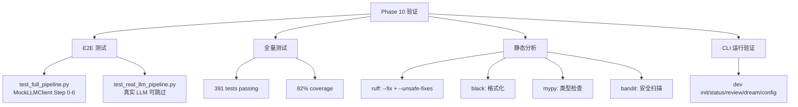

## 产品概述

Phase 10 是 devContextMemo 知识系统的端到端集成与验证阶段，目标是通过全流水线端到端测试和多种静态分析工具，验证系统整体的正确性、可靠性和代码质量。这是项目交付前的最后质量保障环节。

## 核心功能

- **全流水线端到端测试**：Step 0-6 完整流程验证（MockLLMClient 驱动）
  - raw session JSONL → Batcher → Extractor → EntityExtractor → Validator → Deduplicator → Writer → Consolidator
  - 验证 MD 文件生成（staging/knowledge/deprecated 三目录）
  - 验证 DB 记录正确（knowledge_index 表 + FTS5 索引）
  - 验证状态迁移合法性（is_valid_transition）
  - 验证文件移动（晋升 staging→knowledge，废弃 →deprecated）
- **真实 LLM 端到端测试**：使用真实 LLM API 验证提炼/实体提取流程
  - 需要配置 LLM API key
  - 无 key 时 @pytest.mark.skipif 自动跳过
- **全量测试套件**：391 tests passing
  - tests/unit/（17 文件）：原子操作/模型/哈希/搜索/服务/冲突/校准/晋升/修剪/MCP/注入/CLI
  - tests/module/（9 文件）：Step 0-6 模块测试
  - tests/e2e/（2 文件）：全流水线 + 真实 LLM
- **覆盖率测量**：82% 整体覆盖率
- **静态分析**：
  - ruff：--fix 修复 74 issues + --unsafe-fixes 修复 14 issues + 剩余 15（comment length only）
  - black：格式化修复 21 issues
  - mypy：9 minor type annotation errors
  - bandit：SQL injection 误报（参数化查询）+ MD5 acceptable（SimHash 非安全用途）

## 技术栈

- Python 3.13+
- pytest + pytest-cov（测试 + 覆盖率）
- ruff（lint + format）
- black（格式化）
- mypy（类型检查）
- bandit（安全扫描）
- MockLLMClient（mock LLM 响应）

## 实现方案

### 整体策略

Phase 10 聚焦「验证」而非「实现」，主要工作：
1. 编写端到端测试验证全流水线正确性
2. 运行全量测试套件确保无回归
3. 多种静态分析工具交叉验证代码质量
4. CLI 实际运行验证端到端可用性

### 端到端测试设计

```
test_full_pipeline.py:
1. 准备 MockLLMClient（返回预设的 extracted_items/entities）
2. 准备 raw session JSONL（模拟对话日志）
3. 执行 Step 0-5（Receiver→Batcher→Extractor→EntityExtractor→Validator→Deduplicator→Writer）
4. 验证 MD 文件生成（staging/ 或 knowledge/ 目录）
5. 验证 DB 记录（knowledge_index 表 + FTS5 索引）
6. 执行 Step 6（Consolidator）
7. 验证状态迁移（staged→candidate/active 等）
8. 验证文件移动（晋升后 MD 从 staging/ 移到 knowledge/）
```

### 真实 LLM 测试设计

```python
@pytest.mark.skipif(not os.getenv("LLM_API_KEY"), reason="no LLM API key")
def test_real_llm_extraction():
    """真实 LLM 提炼测试（需 API key）。"""
    llm = LLMClient(api_key=os.getenv("LLM_API_KEY"))
    extractor = Extractor(llm, domain_tree, staging_dir)
    output = extractor.process(batch_path)
    records = read_jsonl(output)
    assert all(r["granularity"] in {"L0","L1","L2","L3","L4","L5"} for r in records)
```

### 静态分析修复策略

| 工具 | 问题数 | 处理方式 |
|------|--------|---------|
| ruff --fix | 74 | 自动修复（import 排序、unused import 等） |
| ruff --unsafe-fixes | 14 | 自动修复（f-string 转换等） |
| ruff 剩余 | 15 | 手动评估（comment length，不影响功能） |
| black | 21 | 自动格式化 |
| mypy | 9 | minor type annotation（不影响运行） |
| bandit SQL injection | 误报 | 参数化查询（?占位符），非字符串拼接 |
| bandit MD5 | acceptable | SimHash 用 MD5 做 token 哈希，非安全用途 |

## 架构设计



### 测试目录结构

```
tests/
├── unit/                     # 17 文件 - 单元测试
│   ├── test_atomic.py        # 原子写入/路径校验
│   ├── test_models.py        # 数据模型
│   ├── test_sqlite_store.py  # SQLite 存储
│   ├── test_hash.py          # 哈希函数
│   ├── test_search.py        # 搜索引擎
│   ├── test_markdown_store.py # MD 存储
│   ├── test_knowledge_service.py # 知识服务
│   ├── test_promotion.py     # 晋升评估
│   ├── test_pruning.py       # 修剪规则
│   ├── test_conflict.py      # 冲突检测
│   ├── test_calibration.py   # 校准引擎
│   ├── test_mcp_tools.py     # MCP Tool
│   ├── test_injection.py     # 注入服务
│   ├── test_cli.py           # CLI 命令
│   └── ...
├── module/                   # 9 文件 - 模块测试
│   ├── test_step0_receiver.py ~ test_step6_consolidator.py
├── e2e/                      # 2 文件 - 端到端测试
│   ├── test_full_pipeline.py
│   └── test_real_llm_pipeline.py
├── contracts/                # 契约文件
├── fixtures/                 # 测试夹具
└── conftest.py               # pytest 配置 + fixtures
```

## 关键代码结构

### 全流水线端到端测试（tests/e2e/test_full_pipeline.py 核心）

```python
def test_full_pipeline(tmp_path):
    """端到端全流水线：Step 0-6 完整流程。"""
    # 1. 准备环境
    raw_dir = tmp_path / "raw"
    staging_dir = tmp_path / "staging"
    knowledge_dir = tmp_path / "knowledge"
    deprecated_dir = tmp_path / "deprecated"
    db_path = tmp_path / "test.db"

    # 2. 初始化 stores
    db = SQLiteStore(str(db_path))
    db.init_db()
    md = MarkdownStore(staging_dir, knowledge_dir, deprecated_dir)

    # 3. 准备 MockLLMClient
    mock_llm = MockLLMClient(extracted_items=[...], entities=[...])

    # 4. 执行 Step 0-5
    receiver = Receiver(adapter, raw_dir)
    receiver.receive()
    batcher = Batcher(raw_dir, staging_dir)
    batch_paths = batcher.process(flush_all=True)
    extractor = Extractor(mock_llm, domain_tree, staging_dir)
    summary_path = extractor.process(batch_paths[0])
    entity_extractor = EntityExtractor(mock_llm, staging_dir)
    knowledge_path = entity_extractor.process(summary_path)
    validator = Validator(staging_dir)
    validated_path = validator.process(knowledge_path)
    deduplicator = Deduplicator(staging_dir, existing_records=[])
    deduped_path = deduplicator.process(validated_path)
    writer = Writer(md, db)
    results = writer.process(deduped_path)

    # 5. 验证 MD 文件生成
    assert any(staging_dir.glob("*.md")) or any(knowledge_dir.glob("*/*.md"))

    # 6. 验证 DB 记录
    conn = db.get_connection()
    count = conn.execute("SELECT COUNT(*) FROM knowledge_index").fetchone()[0]
    assert count > 0

    # 7. 执行 Step 6 Consolidator
    consolidator = Consolidator(db, md)
    report = consolidator.process()
    assert report.total_scanned > 0

    # 8. 验证状态迁移
    rows = conn.execute("SELECT status FROM knowledge_index").fetchall()
    statuses = [r[0] for r in rows]
    assert all(s in ALLOWED_TRANSITIONS for s in statuses)
```

## 实现注意事项

- **MockLLMClient 设计**：预设 extracted_items 和 entities 响应，记录 call_history 供断言，counter dict 避免索引偏移
- **端到端测试用 tmp_path**：pytest fixture 提供临时目录，测试结束自动清理
- **真实 LLM 测试可跳过**：`@pytest.mark.skipif(not os.getenv("LLM_API_KEY"))` 无 key 时自动跳过，不阻断 CI
- **ruff comment length**：剩余 15 个 issue 全部是注释/docstring 行数超限，不影响功能，评估后接受
- **bandit SQL injection 误报**：Writer/KnowledgeService 使用 `?` 占位符参数化查询，bandit 误报为 B608
- **bandit MD5 acceptable**：SimHash 用 MD5 做 token 哈希（`usedforsecurity=False`），非安全用途，可接受
- **mypy 9 errors**：minor type annotation 问题（如 `dict[str, Any]` 返回类型），不影响运行时
- **CLI 运行验证**：实际执行 `dev init`/`status`/`review`/`dream`/`config` 命令，确认端到端可用
- **82% coverage**：未覆盖的主要是 LLM 调用分支（需真实 API）和错误处理边缘情况，评估后接受
