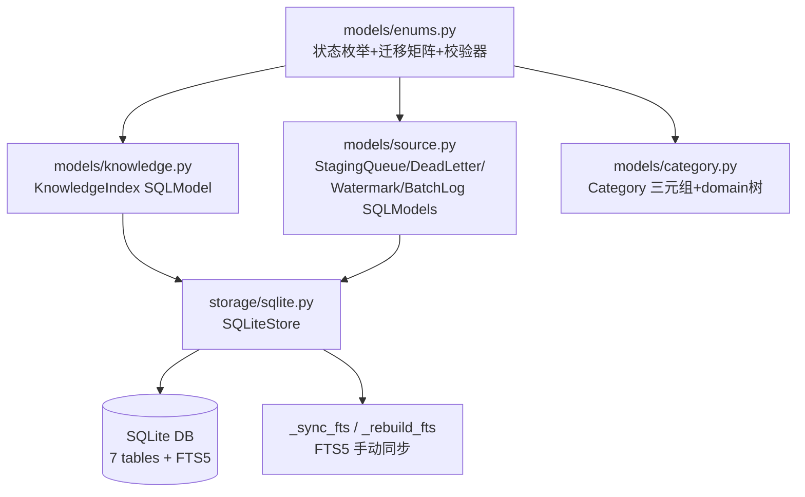

## 产品概述

Phase 2 是 devContextMemo 知识系统的数据基础设施层实现，目标是为后续所有 Phase（流水线、晋升、校准、检索）提供可靠的数据持久化与索引能力。

## 核心功能

- 定义知识条目的完整状态机模型（8 态小写：staged / candidate / pending_review / draft / active / cold / stale / deprecated），对齐 V2.0 晋升生命周期设计
- 定义三元组分类枚举（L0-L5 粒度 / S1-S5 稳定性 / KW-KH-KY 深度）及状态迁移合法性校验
- 创建 SQLite 数据库 7 张表（knowledge_index 主表 + knowledge_fts 全文索引虚拟表 + calibration_log / staging_queue / dead_letter / collector_watermark / batch_log 辅助表），含索引、触发器、WAL 模式配置
- 提供 SQLiteStore 数据访问层：建库、连接管理、FTS5 手动同步、表列举
- 同步更新状态机 YAML 文档与单元测试，确保代码-文档-测试三者一致

## 技术栈

- Python 3.13+（venv 已就绪）
- SQLModel >= 0.0.22（ORM，knowledge_index 主表数据操作）
- sqlite3 标准库（DDL：建表/索引/触发器/FTS5 虚拟表/PRAGMA 设置）
- pytest（单元测试 + fixture）

## 实现方案

### 整体策略

采用「raw SQL 管 DDL + SQLModel 管数据操作」混合模式。原因：FTS5 虚拟表、触发器、PRAGMA 等 DDL 无法通过 SQLModel/SQLAlchemy 声明，必须用原生 SQL；而 knowledge_index 主表的 CRUD 用 SQLModel 可获得类型安全和 Pydantic 校验。

### 状态机迁移矩阵

基于 V2.0 晋升生命周期 T1-T25 跃迁表，构建 allowed_transitions 字典。关键设计：

- RAW 不落 DB（仅内存态），不纳入 DB 状态枚举
- deprecated 是准终态：仅可通过 T20 人工恢复回 staged
- 自迁移（same→same）全部合法（no-op 语义）
- 任意状态 → deprecated 合法（手动废弃）
- 滞回机制在 Phase 5 实现，Phase 2 仅编码迁移合法性
- **严格按 V2.0 T 表（用户确认）**：
- `draft → staged` 非法（无直接跃迁；draft 仅可 → active(T9) / deprecated(T10/T19)）
- `cold → active` 非法（冷知识复活必须经 cold→stale(T13)→active(T15) 完整路径，无捷径）

### SQLiteStore 设计

- `init_db()`：幂等建库，执行全部 DDL（7 表 + 索引 + 触发器 + FTS5 + PRAGMA）
- `get_connection()`：返回已配置 PRAGMA 的连接（WAL / foreign_keys=ON / synchronous=NORMAL）
- `_sync_fts(rowid, title, keywords, summary)`：FTS5 手动同步（INSERT/UPDATE），替代触发器（因 keywords/summary 在 Step 5 才就位）
- `_rebuild_fts()`：FTS5 全量重建（rebuild-db 命令使用）
- `list_tables()`：返回所有表名（含虚拟表），用于验证

### Schema 修正项（实现时修正，记录在代码注释中）

1. **FTS5 DELETE 触发器列引用错误**：V1.1 schema 的 `ki_ad` 触发器引用 `old.keywords` / `old.summary`，但 knowledge_index 表无此两列。修正为传空字符串 `VALUES('delete', old.rowid, old.title, '', '')`
2. **ki_updated_at 递归触发器**：`AFTER UPDATE` 内再 UPDATE 会递归，但条件 `old.updated_at = new.updated_at` 在首次触发后变为 false，天然终止。SQLite 默认递归深度 1000 足够，无需额外处理

### 性能与可靠性

- WAL 模式：读不阻塞写，适合单机多读少写场景
- synchronous=NORMAL：WAL 下安全且性能优于 FULL
- cache_size=-64000（64MB）：Phase 1 规模知识库足够
- auto_vacuum=INCREMENTAL：防止频繁删除导致文件膨胀
- 建库幂等：所有 DDL 使用 `CREATE TABLE IF NOT EXISTS` / `CREATE INDEX IF NOT EXISTS`
- 内存数据库测试：WAL 模式不支持 :memory:，测试时跳过 WAL PRAGMA

## 架构设计



### 数据所有权

- SQLiteStore 是 sqlite_index 的唯一 owner（architecture.yaml data_ownership 约束）
- 上层（pipeline/services）通过 SQLiteStore 接口访问，不直接操作 Connection
- FTS5 是 knowledge_index 的派生索引，可随时从 MD 重建（P2 原则）

## 目录结构

```
src/devcontext/
├── models/
│   ├── __init__.py          # [MODIFY] 导出所有公开类和函数
│   ├── enums.py             # [MODIFY→实现] 8态StatusEnum + Lx/Sy/Depth枚举 + is_valid_transition + 校验器
│   ├── knowledge.py         # [MODIFY→实现] KnowledgeIndex SQLModel + CalibrationLog SQLModel
│   ├── source.py            # [MODIFY→实现] StagingQueue/DeadLetter/CollectorWatermark/BatchLog SQLModels
│   └── category.py          # [MODIFY→实现] Category Pydantic模型 + domain树校验
├── storage/
│   └── sqlite.py            # [MODIFY→实现] SQLiteStore: init_db + 连接管理 + FTS5同步 + 表列举

knowledge-state-machine.yaml  # [MODIFY] V1.0→V1.1: 大写7态→小写8态 + V2.0迁移规则

tests/
├── conftest.py              # [MODIFY] mock_db_records状态名改小写 + 新增db_store fixture
├── unit/
│   ├── test_models.py       # [MODIFY→重写] 适配V1.1 8态 + L0-L5 + devcontext导入路径
│   └── test_sqlite_store.py # [NEW] SQLiteStore建库/表/FTS5/触发器/PRAGMA验证
```

## 关键代码结构

### 状态迁移矩阵（models/enums.py 核心数据结构）

```python
# V2.0 T1-T25 跃迁规则的编码表示
ALLOWED_TRANSITIONS: dict[str, set[str]] = {
    "staged":         {"staged", "candidate", "pending_review", "draft", "deprecated"},
    "candidate":      {"candidate", "active", "pending_review", "deprecated"},
    "pending_review": {"pending_review", "active", "deprecated"},
    "draft":          {"draft", "active", "deprecated"},
    "active":         {"active", "cold", "stale", "deprecated"},
    "cold":           {"cold", "active", "stale", "deprecated"},
    "stale":          {"stale", "active", "deprecated"},
    "deprecated":     {"deprecated", "staged"},
}

def is_valid_transition(from_status: str, to_status: str) -> bool:
    """Check if a status transition is legal per V2.0 lifecycle rules."""
```

### SQLiteStore 接口签名（storage/sqlite.py 核心）

```python
class SQLiteStore:
    def __init__(self, db_path: str) -> None: ...
    def init_db(self) -> None:
        """Idempotent: create all 7 tables, indexes, triggers, FTS5, set PRAGMAs."""
    def get_connection(self) -> sqlite3.Connection: ...
    def list_tables(self) -> list[str]: ...
    def _sync_fts(self, rowid: int, title: str, keywords: str, summary: str) -> None: ...
    def _rebuild_fts(self) -> None: ...
```

## 实现注意事项

- **FTS5 可用性**：Python 内置 sqlite3 可能未编译 FTS5。init_db 时需 try-except 检测，若不可用则跳过 FTS5 创建并 log warning（不阻断建库，检索功能降级）
- **WAL 与 :memory:**：WAL 模式不支持内存数据库，测试 fixture 需检测 db_path 是否为 :memory: 来跳过 WAL PRAGMA
- **触发器列引用修正**：ki_ad DELETE 触发器中 `old.keywords`/`old.summary` 不存在于 knowledge_index，实现时改为空字符串
- **SQLModel 与原生 DDL 分离**：SQLModel table=True 类用于运行时数据操作（Phase 4+），init_db 的 DDL 用原生 SQL 执行，两者通过 `__tablename__` 保持一致
- **测试契约冲突延后处理**：step5_writer.yaml 要求表名 `knowledge` + `content_hash` 字段，与 schema V1.1（`knowledge_index`，无 content_hash）冲突。Phase 2 不碰契约文件，Phase 4 实现 Writer 时再修改
- **V2.0 §8 补充字段延后**：stale_sub_phase / stale_check_count / deprecation_reason 等 7 个字段属于 Phase 5（promotion/pruning）范围，Phase 2 严格按 V1.1 建表