## 产品概述

Phase 4 是 devContextMemo 知识系统的数据写入流水线实现，目标是将对话日志经过 6 步处理（Step 0-5）转化为结构化知识并持久化到 MD 文件 + DB 索引。这是系统的核心数据通道，决定了知识入库的质量与可靠性。

## 核心功能

- **Step 0 Receiver**：适配器路由采集对话日志（OpenCode/Comate/Cursor），三层剥壳去噪（system-reminder/relevant-memories/subagent-context），按 session 分组写入 raw JSONL
- **Step 1 Batcher**：扫描 raw session，按 token 阈值（6000）或全量模式攒批，输出 batch JSONL + _meta.yaml
- **Step 2a Extractor**：LLM 从对话中提取结构化知识（四轴分类 L0-L5/S1-S5/KW-KH-KY + domain + confidence + occurred_at），含截断控制（32K 上下文）和重试机制（3 次）
- **Step 2b EntityExtractor**：LLM 提取实体（class/method/file 等 14 类型）+ 关系（extends/uses 等 10 类型），归一化去重，3 次失败优雅降级返回空
- **Step 3 Validator**：计算 content_hash（SHA-256 精确哈希）+ semantic_hash（SimHash 64 位语义签名），设置 code_verified（entities 含 file 字段 → 1）
- **Step 4 Deduplicator**：content_hash 精确匹配 → 重复 skip；Jaccard ≥ 0.90 → 高度相似；≤ 0.30 → 全新
- **Step 5 Writer**：MD first → DB second 原子写入，绿色通道（confidence ≥ 0.95 → 直接 knowledge/），FTS5 同步

## 技术栈

- Python 3.13+（json / re / pathlib / hashlib / collections 标准库）
- PyYAML（_meta.yaml 读写）
- LLM API（MiniMax / GLM，通过 utils/llm.py LLMClient 封装）
- pytest（模块测试 + MockLLMClient）

## 实现方案

### 整体策略（Q1 拆 3 子 Phase）

流水线按依赖关系拆分为 3 个子 Phase 串行实现：

- **Phase 4a**：Step 0 + Step 1（无 LLM 依赖，纯 IO + 文本处理）
- **Phase 4b**：Step 2a + Step 2b + Step 3（LLM 依赖，核心提炼逻辑）
- **Phase 4c**：Step 4 + Step 5（哈希去重 + 持久化，依赖 Phase 3 MarkdownStore + Phase 2 SQLiteStore）

### Step 6 归属决策（Q2 Step 6 归 Phase 5）

Step 6 Consolidator（晋升+修剪+巩固）归入 Phase 5，原因：
- Step 6 依赖 promotion/pruning 规则（Phase 5 核心内容）
- Phase 4 聚焦「数据写入」，Phase 5 聚焦「生命周期管理」
- 保持每个 Phase 的内聚性

### content_hash 中间态决策（Q3）

content_hash / semantic_hash 仅在 JSONL 中间态（Step 3→4→5 流转）使用，不存入 DB：
- DB 的 knowledge_index 表无 content_hash 字段（Phase 2 严格按 schema V1.1）
- 去重比对在 Step 4 内存中完成，结果（top_similar_id/jaccard_score）也不入 DB
- 简化 DB schema，避免冗余字段

### 去重算法决策（Q4 SimHash + Jaccard）

使用纯确定性算法，无需 embedding 模型：
- **content_hash（SHA-256）**：检测完全相同的内容（精确匹配）
- **semantic_hash（SimHash 64 位）**：检测语义相似（汉明距离 < 10）
- **jaccard_similarity（bigram 集合）**：相似度量化（0.0-1.0）
- embedding/cosine 预留接口，后续 Phase 接入

### token 估算策略

中文约 1 token/字符，英文约 1 token/4 字符，取折中 `len(content) // 2`：
- Batcher 阈值触发用（6000 token）
- Extractor 截断控制用（32K 上下文限制）
- 后续可替换为 tiktoken 精确计数

### 绿色通道

confidence ≥ 0.95 → 直接写 `knowledge/{domain}/`（跳过 staging），否则写 `staging/`：
- 高置信度知识无需人工审核
- 与 Phase 5 晋升公式独立（绿色通道在 Step 5 写入时判断，不经过 promotion 评分）

## 架构设计

```mermaid
graph LR
    A[OpenCode/Comate/Cursor] --> B[Step 0 Receiver<br/>剥壳+分组]
    B --> C[raw/session_*.jsonl]
    C --> D[Step 1 Batcher<br/>token≥6000]
    D --> E[batch_*.jsonl]
    E --> F[Step 2a Extractor<br/>LLM 提炼]
    F --> G[summary_*.jsonl]
    G --> H[Step 2b EntityExtractor<br/>LLM 实体关系]
    H --> I[knowledge_*.jsonl]
    I --> J[Step 3 Validator<br/>hash+code_verified]
    J --> K[knowledge_*.jsonl<br/>+hash]
    K --> L[Step 4 Deduplicator<br/>Jaccard 去重]
    L --> M[knowledge_*.jsonl<br/>+dedup]
    M --> N[Step 5 Writer<br/>MD first→DB second]
    N --> O[(MD files)]
    N --> P[(SQLite DB)]
```



### 数据流转格式

每步输入输出均为 JSONL，字段逐步累加：

| Step | 输出文件 | 新增字段 |
|------|---------|---------|
| 0 | session_*.jsonl | session_id, seq, role, content, timestamp, source |
| 1 | batch_*.jsonl | (同上，攒批) + _meta.yaml |
| 2a | summary_*.jsonl | knowledge_text, granularity, stability, depth, domain, confidence, occurred_at |
| 2b | knowledge_*.jsonl | entities[], relations[] |
| 3 | knowledge_*.jsonl | content_hash, semantic_hash, code_verified |
| 4 | knowledge_*.jsonl | top_similar_id, jaccard_score, is_duplicate |
| 5 | MD + DB | 持久化（跳过 is_duplicate=true） |

## 目录结构

```
src/devcontext/
├── core/
│   ├── adapters/
│   │   ├── __init__.py
│   │   ├── base.py            # [NEW] BaseAdapter 抽象基类
│   │   ├── opencode.py        # [NEW] OpenCode SQLite 适配器
│   │   ├── comate.py          # [NEW] Comate JSON 适配器
│   │   └── cursor.py          # [NEW] Cursor 适配器
│   └── pipeline/
│       ├── __init__.py
│       ├── receiver.py        # [NEW] Step 0 统一接收
│       ├── batcher.py         # [NEW] Step 1 攒批
│       ├── extractor.py       # [NEW] Step 2a LLM 提炼
│       ├── entity_extractor.py # [NEW] Step 2b 实体关系
│       ├── validator.py       # [NEW] Step 3 签名验证
│       ├── deduplicator.py    # [NEW] Step 4 去重
│       └── writer.py          # [NEW] Step 5 MD+DB 写入
├── utils/
│   ├── hash.py                # [NEW] SHA-256 + SimHash + Jaccard
│   └── llm.py                 # [NEW] LLMClient 封装

tests/
├── module/
│   ├── test_step0_receiver.py
│   ├── test_step1_batcher.py
│   ├── test_step2a_extractor.py
│   ├── test_step2b_entity_extractor.py
│   ├── test_step3_validator.py
│   ├── test_step4_deduplicator.py
│   └── test_step5_writer.py
├── unit/
│   └── test_hash.py
└── conftest.py                # [MODIFY] MockLLMClient + fixtures
```

## 关键代码结构

### SimHash 算法（utils/hash.py 核心）

```python
def semantic_hash(text: str) -> str:
    """SimHash 64 位语义签名。
    1. normalize_text（转小写+去标点+折叠空白）
    2. 字符 bigram 分词（支持 CJK）
    3. 每个 token MD5 哈希为 64 位整数
    4. 逐位累加（位为1则+weight，为0则-weight）
    5. 每位>0取1，否则取0 → 64位指纹
    """
    normalized = normalize_text(text).replace(" ", "")
    tokens = _tokenize_bigram(normalized)
    token_counts = Counter(tokens)
    bits = [0] * 64
    for token, weight in token_counts.items():
        token_hash = int(hashlib.md5(token.encode()).hexdigest(), 16)
        for i in range(64):
            if token_hash & (1 << i):
                bits[i] += weight
            else:
                bits[i] -= weight
    fingerprint = sum(1 << i for i in range(64) if bits[i] > 0)
    return f"{fingerprint:016x}"
```

### Writer 绿色通道（core/pipeline/writer.py 核心）

```python
GREEN_CHANNEL_THRESHOLD = 0.95

class Writer:
    def _write_one(self, record: dict) -> WriteResult:
        knowledge_id = self._generate_id()  # kw-{YYYYMMDD}-{seq}
        confidence = float(record.get("confidence", 0.0))
        use_green_channel = confidence >= GREEN_CHANNEL_THRESHOLD
        # Step 1: MD first
        if use_green_channel:
            md_path = self.md_store.write_to_knowledge(md_record)
        else:
            md_path = self.md_store.write_to_staging(md_record)
        # Step 2: DB second
        if self.db_store is not None:
            db_record = self.md_store.to_db_dict(md_record, md_path)
            self._insert_db(db_record)
            if self.db_store.fts_available:
                self.db_store._sync_fts(rowid, title, keywords, summary)
```

## 实现注意事项

- **Batcher token 估算**：测试时 `len//2` 估算偏低，需增大测试数据量确保触发阈值（Phase 4a 修复）
- **MockLLMClient call_history**：测试 mock 需用 counter dict 记录调用次数，避免索引偏移（Phase 4b 修复）
- **Extractor 截断**：32K 上下文限制，截断时 max_confidence 降为 0.80（惩罚截断导致的信息丢失）
- **EntityExtractor 优雅降级**：3 次 LLM 失败返回空 entities/relations，不阻断流水线
- **Validator code_verified**：entities 中含至少一个 file 字段 → 1，否则 → 0（代码锚点判定）
- **Deduplicator 三区间**：≥0.90 重复 skip / ≤0.30 全新 / 中间区间标记相似但不视为重复
- **Writer 跳过重复**：`is_duplicate=true` 的记录在 Step 5 直接 skip，不写 MD 也不写 DB
- **Writer ID 生成**：`kw-{YYYYMMDD}-{seq:03d}`，seq 为 Writer 实例内计数器
- **FTS5 同步**：Writer 在 DB INSERT 后调用 `_sync_fts`，keywords 取 concept_tags，summary 取 knowledge_text 前 200 字符
