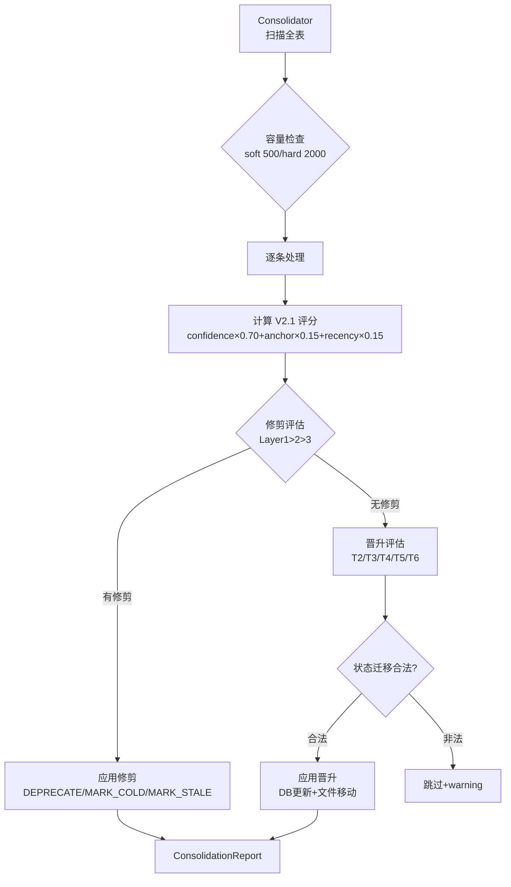

## 产品概述

Phase 5 是 devContextMemo 知识系统的生命周期管理核心实现，目标是实现知识的自动晋升、修剪与巩固机制。基于 V2.0 晋升生命周期设计，通过 V2.1 评分公式量化知识质量，结合三层修剪体系和滞回机制，实现知识库的自适应演化。

## 核心功能

- **V2.1 晋升评分公式**：`promotion_score = confidence × 0.70 + anchor_bonus × 0.15 + calibration_recency × 0.15`
- **滞回机制**：CANDIDATE 进入门槛 0.82，退出门槛 0.80（0.02 缓冲区防震荡）
- **绿色通道（T2）**：confidence ≥ 0.95 → 直接 ACTIVE（与评分公式独立）
- **STALE 子阶段**：suspicious(count=1,×0.80) → confirmed(count=2,×0.60) → deep(count=3,×0.40) → T16 废弃
- **三层修剪体系**：
  - Layer 1：DRAFT 质量下限（confidence<0.6 且 age>30d → low_quality；age>90d → stale_draft）
  - Layer 2：使用频率（COLD>365d → STALE；prune_priority≥0.70 → STALE；ACTIVE+anchor+低使用 → COLD）
  - Layer 3：代码锚点（无锚点+age>90d → STALE T14；无锚点+prune_priority≥0.70+age≥60d → STALE T25）
- **容量管理**：soft_limit=500（告警）/ hard_limit=2000（强制修剪）
- **Step 6 Consolidator**：批量扫描全表，评估每条知识的晋升/修剪决策，执行状态迁移 + 物理文件移动

## 技术栈

- Python 3.13+（datetime / pathlib 标准库）
- SQLite（knowledge_index 表 V1.3 schema）
- pytest（单元测试 + 模块测试）

## 实现方案

### 整体策略（方案 A 完整 V2.0）

完整实现 V2.0 晋升生命周期的所有跃迁规则（T1-T25）和修补（V19 累积折扣 / V21 滞回 / V23 locked_score 忽略 time_decay），不简化不跳过。

### Schema V1.3 迁移（+7 字段）

knowledge_index 表新增 7 个晋升生命周期字段：

| 字段 | 类型 | 用途 |
|------|------|------|
| locked_promotion_score | REAL | CANDIDATE 进入时锁定的首轮分数（T6 二次确认用） |
| stale_check_count | INTEGER DEFAULT 0 | STALE 检查次数（累积折扣用） |
| stale_sub_phase | TEXT | STALE 子阶段（suspicious/confirmed/deep） |
| stale_entered_at | TEXT | 进入 STALE 的时间 |
| deprecation_reason | TEXT | 废弃原因（superseded/verification_failed/...） |
| superseded_by | TEXT | 被哪个新版本取代 |
| successor_id | TEXT | 后继知识 ID（修订链） |

### V2.1 评分公式

```
promotion_score = confidence × 0.70 + anchor_bonus × 0.15 + calibration_recency × 0.15

anchor_bonus:
    code_verified == 1 → 1.0
    else → 0.0

calibration_recency = 1.0 - min(days_since_last_calibration / 180, 1.0)
    从未校准 → 0.0
    刚刚校准 → ≈1.0
```

### 滞回机制

CANDIDATE 状态的进出采用不同阈值，防止分数在边界附近震荡：
- 进入门槛：base_score ≥ 0.82 → staged→candidate (T3)
- 退出门槛：base_score < 0.80 → candidate→pending_review
- 0.80 ≤ score < 0.82 → 保留 CANDIDATE（缓冲区）

### T6 优先于滞回（修复项）

当 CANDIDATE 有 locked_score 时，T6（locked_score 二次确认）优先于滞回退出检查：
- locked_score ≥ 0.80 → candidate→active (T6)
- locked_score < 0.80 → candidate→pending_review
- 无 locked_score → 用当前 base_score 判断滞回

### STALE 子阶段累积折扣（V19）

```
suspicious (count=1) → original_confidence × 0.80
confirmed  (count=2) → original_confidence × 0.60
deep       (count=3) → original_confidence × 0.40 → 触发 T16 废弃
```

### 修剪优先于晋升（V2.0 §6.6）

Consolidator 处理每条知识时，先评估修剪（Layer1 > Layer2 > Layer3），有修剪动作则跳过晋升评估。

## 架构设计



### 跃迁规则编码

```
T2:  staged → active (绿色通道 confidence≥0.95)
T3:  staged → candidate (score≥0.82)
T4:  staged → pending_review (0.65≤score<0.82)
T5:  staged → draft (score<0.65)
T6:  candidate → active (locked_score≥0.80)
T11: active → cold (anchor+低使用)
T12: → stale (低确定度 INCONSISTENT)
T13: cold → stale (>365d)
T14: active → stale (无锚点+age>90d)
T15: stale → active (重新验证通过)
T16: stale → deprecated (count≥3)
T19: draft → deprecated (低质清理)
T25: active → stale (无锚点+prune_priority≥0.70+age≥60d)
```

## 目录结构

```
src/devcontext/
├── core/
│   ├── promotion.py          # [NEW] V2.1 公式 + 滞回 + STALE 子阶段
│   ├── pruning.py            # [NEW] 三层修剪 + 容量管理
│   └── pipeline/
│       └── consolidator.py   # [NEW] Step 6 巩固器
├── storage/
│   └── sqlite.py             # [MODIFY] Schema V1.3 +7 字段

tests/
├── unit/
│   ├── test_promotion.py     # [NEW] V2.1 公式/滞回/绿色通道/STALE
│   └── test_pruning.py       # [NEW] 三层规则/容量/supplement
├── module/
│   └── test_step6_consolidator.py # [NEW] 批量巩固/文件移动/dry_run
```

## 关键代码结构

### V2.1 评分公式（core/promotion.py 核心）

```python
W_CONFIDENCE = 0.70
W_ANCHOR_BONUS = 0.15
W_CALIBRATION_RECENCY = 0.15
CANDIDATE_ENTER_THRESHOLD = 0.82
CANDIDATE_EXIT_THRESHOLD = 0.80
GREEN_CHANNEL_THRESHOLD = 0.95

def calculate_base_score(confidence, anchor_bonus, calibration_recency) -> float:
    return (confidence * W_CONFIDENCE
            + anchor_bonus * W_ANCHOR_BONUS
            + calibration_recency * W_CALIBRATION_RECENCY)
```

### 滞回 + T6 优先（core/promotion.py 核心）

```python
def evaluate_promotion(base_score, current_status, confidence, locked_score):
    # 绿色通道 T2
    if confidence >= 0.95 and current_status == "staged":
        return {"new_status": "active", "transition": "T2"}
    # CANDIDATE: T6 优先于滞回
    if current_status == "candidate":
        if locked_score is not None:  # T6 优先
            if locked_score >= 0.80:
                return {"new_status": "active", "transition": "T6"}
            else:
                return {"new_status": "pending_review"}
        if base_score < 0.80:  # 滞回退出
            return {"new_status": "pending_review"}
        return {"new_status": "candidate"}  # 保留
    # 首次评估 T3/T4/T5
    if current_status == "staged":
        if base_score >= 0.82: return {"new_status": "candidate", "transition": "T3"}
        elif base_score >= 0.65: return {"new_status": "pending_review", "transition": "T4"}
        else: return {"new_status": "draft", "transition": "T5"}
```

### Consolidator 处理流程（core/pipeline/consolidator.py 核心）

```python
class Consolidator:
    def process(self) -> ConsolidationReport:
        rows = conn.execute("SELECT * FROM knowledge_index ORDER BY created_at").fetchall()
        check_capacity(len(rows))
        for row in rows:
            self._process_record(record, report)

    def _process_record(self, record, report):
        base_score = calculate_base_score(confidence, anchor_bonus, cal_recency)
        # 修剪优先于晋升
        prune_action = self._evaluate_pruning(record, report)
        if prune_action:
            if not self.dry_run:
                self._apply_pruning(record, prune_action, report)
            return detail
        # 晋升评估
        promo = evaluate_promotion(base_score, status, confidence, locked_score)
        if promo["new_status"] != current_status:
            if is_valid_transition(current_status, promo["new_status"]):
                if not self.dry_run:
                    self._apply_promotion(record, promo, base_score, report)
```

### 文件移动逻辑

```python
def _move_file(self, record, new_status, report):
    if new_status in ("active", "cold", "stale"):
        dest_dir = self.md_store.knowledge_dir / record["domain"]  # staging→knowledge
    elif new_status == "deprecated":
        dest_dir = self.md_store.deprecated_dir  # →deprecated
    src.rename(dest)
    self._update_db(record["id"], {"uri": str(dest)})
```

## 实现注意事项

- **T6 vs 滞回顺序**：CANDIDATE 有 locked_score 时必须先检查 T6，再检查滞回退出。否则 locked_score 高的知识会被滞回误判降级（Phase 5 修复项）
- **修剪优先**：Consolidator 先评估修剪，有修剪动作则跳过晋升。避免被修剪的知识同时触发晋升
- **STALE 置信度折扣**：进入 STALE 时 confidence 乘以折扣系数（0.80/0.60/0.40），恢复时还原 original_confidence
- **CANDIDATE 锁定 score**：staged→candidate (T3) 时锁定 base_score 到 locked_promotion_score，T6 二次确认用
- **STALE→ACTIVE 恢复**：T15 恢复时重置 stale_check_count=0 / stale_sub_phase=None / stale_entered_at=None
- **dry_run 模式**：只评估不实际修改 DB 和文件，用于预览巩固结果
- **文件移动安全**：目标目录不存在时 mkdir parents=True，rename 失败 log error 但不中断
- **Schema 迁移幂等**：ALTER TABLE ADD COLUMN 使用 try-except 检测列已存在，支持重复执行
