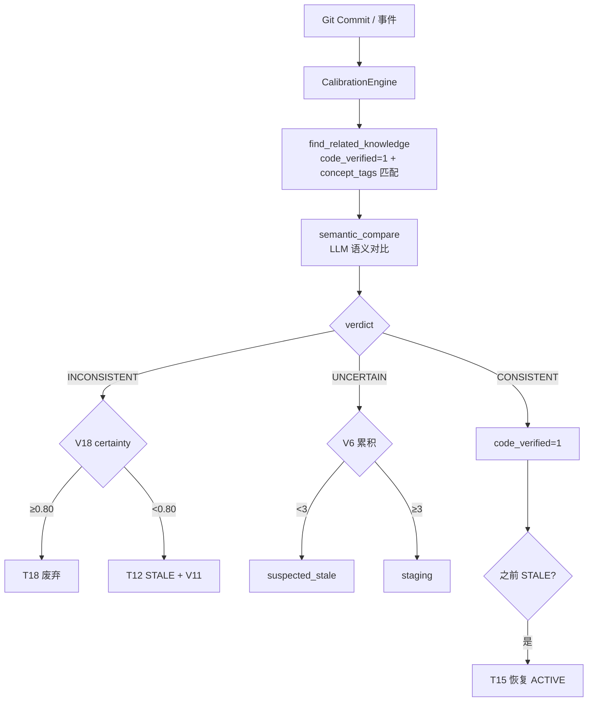
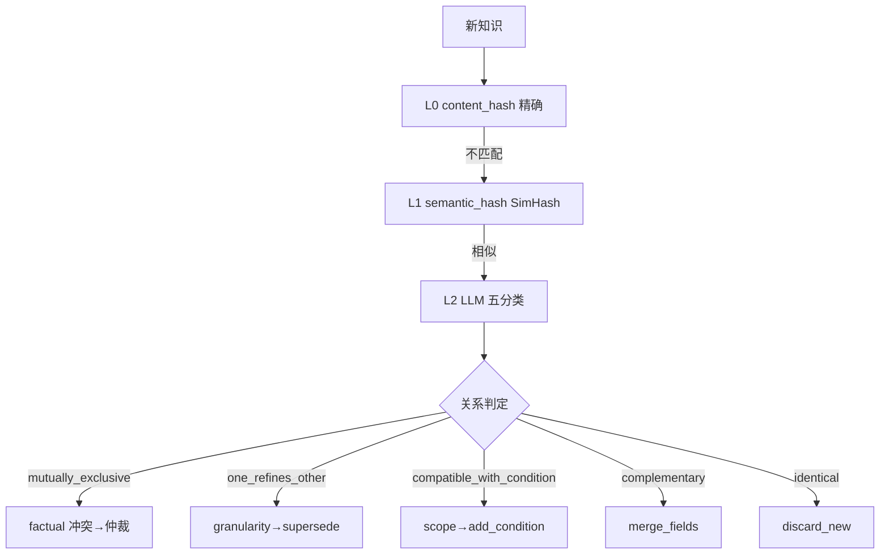

## 产品概述

Phase 6 是 devContextMemo 知识系统的保真度管理实现，目标是检测知识间的冲突并响应代码变更自动校准知识状态。基于 V1.7 知识更新深度设计，通过 L0-L5 六层冲突检测和 E1-E8 校准触发事件，结合证据可信度层级和 certainty 分流，实现知识库与代码现状的一致性维护。

## 核心功能

- **L0-L5 六层冲突检测**：
  - L0：content_hash 精确匹配（完全相同）
  - L1：semantic_hash SimHash 相似（汉明距离 < 10）
  - L2：LLM 矛盾检测（五分类判定）
  - L3：交叉扫描（同 domain pairwise Jaccard ≥ 0.85）
  - L4：代码一致性检测（调 CalibrationEngine）
  - L5：人工检测（预留）
- **6 类冲突分类**：factual（事实）/ temporal（时效）/ scope（范围）/ granularity（粒度）/ implicit（隐式）/ human（人为）
- **LLM 五分类**：mutually_exclusive / one_refines_other / compatible_with_condition / complementary / identical
- **证据可信度层级（6 级）**：
  - Level 5：活代码事实（weight 1.0）
  - Level 4：配置/文档（weight 0.9）
  - Level 3：用户陈述（weight 0.7）
  - Level 2：隐式推断（weight 0.5）
  - Level 1：LLM 推理（weight 0.3）
  - Level 0：无证据（weight 0.0）
- **V1 代码活性检查**：@Deprecated → 降级 L2 / 不可达 → 降级 L3 / 90天内修改 → L5
- **V9 仲裁阈值**：auto_adopt（差值 ≥ 阈值）/ manual_required / dual_discard（双方都低）
- **V5 quarantined 降级**：自动采用未审核 ≥ 3 次 → confidence -0.15
- **校准引擎 E1-E8 触发**：最核心 E1（git commit）→ 查找关联知识 → LLM 语义对比
- **V18 certainty 分流**：高确定度（≥0.80）INCONSISTENT → T18 直接废弃；低确定度 → T12 STALE
- **V6 UNCERTAIN 三级响应**：即时警告（suspected_stale）→ 累积升级（≥3 次 → staging）→ 长期降级
- **V11 INCONSISTENT 即时标记**：低确定度不一致 → 立即标记 stale(suspicious)
- **V12 evidence 折扣**：UNCERTAIN 次数 2→×0.80 / 3→×0.60
- **T15 STALE→ACTIVE 恢复**：校准通过 → 重置 stale 字段 + code_verified=1

## 技术栈

- Python 3.13+（datetime / json / pathlib 标准库）
- SQLite（knowledge_index 表 V1.4 schema）
- LLM API（语义对比 + 五分类判定）
- pytest（单元测试）

## 实现方案

### 整体策略（方案 A 完整 V1.7）

完整实现 V1.7 知识更新深度设计的所有修补（V1 代码活性 / V5 降级 / V6 三级响应 / V9 仲裁阈值 / V11 即时标记 / V12 evidence 折扣 / V13 间接验证 / V18 certainty 分流），不简化不跳过。

### Schema V1.4 迁移（+8 字段）

knowledge_index 表新增 8 个知识保真度字段：

| 字段 | 类型 | 用途 |
|------|------|------|
| evidence_level | INTEGER DEFAULT 3 | 证据可信度层级 0-5 |
| code_active | INTEGER DEFAULT 1 | 代码是否活跃（V1） |
| auto_adopted_unreviewed | INTEGER DEFAULT 0 | 自动采用未审核次数（V5） |
| last_calibrated_at | TEXT | 最后校准时间 |
| calibration_status | TEXT | 校准状态（verified/stale/uncertain/conflict） |
| prune_priority | REAL DEFAULT 0.0 | 修剪优先级 0.0-1.0 |
| certainty | REAL | LLM 确定度 0.0-1.0 |
| freshness | REAL | 新鲜度（校准时效衍生） |

### 证据权重计算

```python
EVIDENCE_WEIGHTS = {5: 1.0, 4: 0.9, 3: 0.7, 2: 0.5, 1: 0.3, 0: 0.0}

def compute_evidence_weight(evidence_level, code_active=True, uncertain_count=0):
    base_weight = EVIDENCE_WEIGHTS[evidence_level]
    # V1: dead code 降级
    if evidence_level == 5 and not code_active:
        base_weight = EVIDENCE_WEIGHTS[2]  # 降级到 Level 2
    # V12: UNCERTAIN 折扣
    if uncertain_count > 0:
        discount = {1: 1.0, 2: 0.80, 3: 0.60}.get(uncertain_count, 0.40)
        base_weight *= discount
    return base_weight
```

### 仲裁流程

```
1. 计算双方证据权重（含 V1 降级 + V12 折扣）
2. 仲裁得分 = evidence_weight × confidence
3. V9 阈值判定：
   - 双方得分都 < dual_discard → dual_discard
   - 差值 ≥ auto_adopt → auto_adopt（V5 quarantined）
   - 其他 → manual_required
```

### V18 certainty 分流

```
INCONSISTENT:
    certainty ≥ 0.80 → T18 直接废弃（direct_contradiction）
    certainty < 0.80 → T12 STALE(suspicious) + V11 即时标记 + V19 置信度折扣

UNCERTAIN:
    count < 3 → V6 级 1：suspected_stale（保留 knowledge/ 但状态可疑）
    count ≥ 3 → V6 级 2：累积升级 → staging

CONSISTENT:
    code_verified = 1 + last_calibrated_at 更新
    如果之前是 STALE → T15 恢复到 ACTIVE
```

## 架构设计



### 冲突检测层次



## 目录结构

```
src/devcontext/
├── core/
│   ├── conflict.py           # [NEW] 冲突检测 L0-L5 + 仲裁
│   └── calibration.py        # [NEW] 校准引擎 E1-E8
├── storage/
│   └── sqlite.py             # [MODIFY] Schema V1.4 +8 字段
├── config.py                 # [MODIFY] 仲裁阈值配置

tests/
├── unit/
│   ├── test_conflict.py      # [NEW] L0-L5/证据/仲裁/V1/V5
│   └── test_calibration.py   # [NEW] 触发/对比/V18/V6/T15
```

## 关键代码结构

### LLM 五分类判定（core/conflict.py 核心）

```python
RELATION_MUTUALLY_EXCLUSIVE = "mutually_exclusive"
RELATION_ONE_REFINES_OTHER = "one_refines_other"
RELATION_COMPATIBLE_WITH_CONDITION = "compatible_with_condition"
RELATION_COMPLEMENTARY = "complementary"
RELATION_IDENTICAL = "identical"

# 关系 → 冲突类型 + 动作映射
RELATION_MAPPING = {
    "mutually_exclusive": ("factual", "arbitrate"),
    "one_refines_other": ("granularity", "supersede_old"),
    "compatible_with_condition": ("scope", "add_condition"),
    "complementary": (None, "merge_fields"),
    "identical": (None, "discard_new"),
}
```

### V18 certainty 分流（core/calibration.py 核心）

```python
HIGH_CERTAINTY_THRESHOLD = 0.80

def _calibrate_one(self, record, event):
    judgment = self.semantic_compare(knowledge_text, code_content)
    verdict = judgment["verdict"]
    certainty = judgment["certainty"]

    if verdict == INCONSISTENT:
        if certainty >= HIGH_CERTAINTY_THRESHOLD:
            # T18: 高确定度 → 直接废弃
            self._apply_calibration(kid, {"status": "deprecated",
                "deprecation_reason": "direct_contradiction"})
        else:
            # T12+V11: 低确定度 → STALE(suspicious)
            self._apply_calibration(kid, {"status": "stale",
                "stale_check_count": count + 1, "confidence": conf * 0.80})

    elif verdict == UNCERTAIN:
        # V6 三级响应
        if count + 1 >= 3:
            self._apply_calibration(kid, {"status": "staged"})  # 累积升级
        else:
            self._apply_calibration(kid, {"status": "stale",
                "flag": "suspected_stale"})  # 即时警告

    elif verdict == CONSISTENT:
        self._apply_calibration(kid, {"code_verified": 1})
        if current_status == "stale":
            # T15 恢复
            self._apply_calibration(kid, {"status": "active",
                "stale_check_count": 0})
```

### V1 代码活性检查（core/conflict.py 核心）

```python
@staticmethod
def check_code_active(file_path, project_root=None) -> tuple[bool, int]:
    """三选一检测：
    ① @Deprecated 注解 → (False, 2)
    ② 代码可达性（grep import ≥ 1）→ (True/False, 5/3)
    ③ 最近 90 天修改过 → (True, 5)
    """
    content = path.read_text()
    if "@Deprecated" in content:
        return False, 2  # 降级 Level 2
    if project_root and import_count == 0:
        return False, 3  # 降级 Level 3
    if days_since_modified <= 90:
        return True, 5  # 活代码
    return True, 5  # 默认活代码
```

## 实现注意事项

- **check_code_active 必须加 @staticmethod**：否则 self 参数导致调用签名不匹配（Phase 6 修复项）
- **L3 交叉扫描复杂度**：pairwise 比较是 O(n²)，大规模知识库需限制 domain 范围或采样
- **L4 代码一致性复用 CalibrationEngine**：通过 `CalibrationEngine.__new__` 创建轻量实例避免循环依赖
- **V18 分流阈值 0.80**：高确定度 INCONSISTENT 直接废弃（T18），低确定度进 STALE（T12），避免误杀
- **V6 累积升级**：UNCERTAIN 累计 3 次后从 knowledge/ 移回 staging/ 重新提炼
- **V12 evidence 折扣**：UNCERTAIN 次数影响证据权重，2 次 ×0.80 / 3 次 ×0.60
- **仲裁得分 = evidence_weight × confidence**：不是简单比 confidence，证据层级高的知识优先
- **V5 quarantined/**：auto_adopt 的落败知识进入 quarantined/ 目录（非直接删除），保留恢复可能
- **find_related_knowledge 简化匹配**：通过 concept_tags 中的名称与变更文件名/stem 匹配，非精确 AST 分析
- **semantic_compare 截断**：代码内容截取前 8000 字符防止 token 超限
