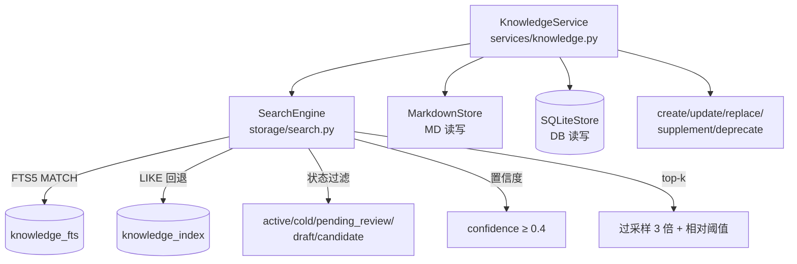

## 产品概述

Phase 7 是 devContextMemo 知识系统的检索与服务层实现，目标是提供高效的全文搜索能力和统一的知识 CRUD 接口。基于 FTS5 全文索引和 BM25 排序算法，结合状态过滤和置信度阈值，为 MCP Tool 和 CLI 提供底层的检索与操作能力。

## 核心功能

- **FTS5 全文搜索**：MATCH 查询 + BM25 排序 + snippet 高亮 + top-k 过滤
- **CJK LIKE 回退**：FTS5 unicode61 分词器不按 CJK 字分词 → 返回空时自动回退到 LIKE 查询
- **状态过滤**：可检索状态 = active/cold/pending_review/draft/candidate（排除 staged/stale/deprecated）
- **置信度阈值**：confidence ≥ 0.4（低质知识不注入）
- **分层过滤**：domain / depth (KW/KH/KY) / stability_min (S1-S5 范围)
- **top-k 过采样**：查询 top_k × 3 条，再用相对阈值（topScore × 0.15）过滤，第 1 名永远保留
- **KnowledgeService 五操作**：
  - `create`：新建知识（绿色通道 confidence≥0.95 → knowledge/，否则 staging/）
  - `update`：更新知识（旧版本→deprecated + 新版本→staging + 修订链 superseded_by/successor_id）
  - `replace`：替换知识（直接覆盖 MD 正文，保留 frontmatter）
  - `supplement`：追加补充（不修改原文，追加 `## 补充` 段落）
  - `deprecate`：废弃知识（状态迁移校验 + 文件移动到 deprecated/）

## 技术栈

- Python 3.13+（sqlite3 标准库）
- SQLite FTS5（全文索引 + BM25 排序 + snippet）
- pytest（单元测试）

## 实现方案

### 整体策略

搜索分为两层：
- **底层 SearchEngine**：纯 FTS5/LIKE 查询，返回 SearchResult 列表
- **上层 KnowledgeService**：CRUD 五操作 + 委托 SearchEngine 做检索

### FTS5 CJK 回退策略

```
1. 先尝试 FTS5 MATCH 查询
2. 如果返回空行 → FTS5 对 CJK 分词失败 → 回退到 LIKE 查询
3. LIKE 查询：title LIKE '%query%' OR domain LIKE '%query%'
4. LIKE 结果 score 设为 1.0（保证相对阈值过滤不丢弃）
```

### 可检索状态设计

对齐 Schema V1.1 §2.3：
- **可检索**：active, cold, pending_review, draft, candidate
- **排除**：staged（未审核）/ stale（即将删除）/ deprecated（已废弃）

### top-k 过采样与相对阈值

```
1. 查询 LIMIT top_k × 3（过采样 3 倍，避免 BM25 排序后有效结果不足）
2. 相对阈值过滤：score < topScore × 0.15 丢弃
3. 第 1 名永远保留（即使分数很低）
4. 截取前 top_k 条
```

### 五操作设计

| 操作 | MD 文件 | DB | 特殊处理 |
|------|---------|-----|---------|
| create | write_to_staging/knowledge | INSERT | 绿色通道 confidence≥0.95 |
| update | 旧→deprecated/, 新→staging/ | 旧 UPDATE + 新 INSERT | 修订链 superseded_by/successor_id |
| replace | 覆盖正文保留 frontmatter | 不变 | 仅 MD 层面 |
| supplement | 追加 `## 补充` 段落 | 不变 | 不修改原文 |
| deprecate | →deprecated/ | UPDATE status | 状态迁移合法性校验 |

## 架构设计



## 目录结构

```
src/devcontext/
├── storage/
│   └── search.py             # [NEW] FTS5 搜索引擎 + LIKE 回退
├── services/
│   ├── __init__.py
│   └── knowledge.py          # [NEW] KnowledgeService 五操作

tests/
├── unit/
│   ├── test_search.py        # [NEW] FTS5/LIKE/过滤/top-k
│   └── test_knowledge_service.py # [NEW] 五操作 CRUD
```

## 关键代码结构

### FTS5 搜索 + CJK 回退（storage/search.py 核心）

```python
SEARCHABLE_STATUSES = ("active", "cold", "pending_review", "draft", "candidate")
MIN_CONFIDENCE = 0.4

class SearchEngine:
    def search(self, query, *, domain=None, depth=None,
               stability_min=None, top_k=10, confidence_min=0.4):
        if not self.db.fts_available:
            return self._fallback_search(query, domain, top_k, confidence_min)

        sql = """
            SELECT k.id, k.title, k.domain, k.uri, k.confidence,
                   bm25(knowledge_fts) as score,
                   snippet(knowledge_fts, 0, '<b>', '</b>', '...', 32) as snippet
            FROM knowledge_fts
            JOIN knowledge_index k ON k.rowid = knowledge_fts.rowid
            WHERE knowledge_fts MATCH ?
              AND k.status IN ({})
              AND k.confidence >= ?
            ORDER BY score DESC LIMIT ?
        """
        try:
            rows = conn.execute(sql, params).fetchall()
        except Exception:
            return self._fallback_search(...)

        # FTS5 CJK 返回空 → LIKE 回退
        if not rows:
            return self._fallback_search(query, domain, top_k, confidence_min)

        # 相对阈值过滤
        top_score = results[0].score
        threshold = top_score * 0.15
        filtered = [r for r in results if r.score >= threshold or r is results[0]]
        return filtered[:top_k]
```

### KnowledgeService 五操作（services/knowledge.py 核心）

```python
class KnowledgeService:
    def __init__(self, sqlite_store, markdown_store, search_engine):
        self.db = sqlite_store
        self.md = markdown_store
        self.search_engine = search_engine  # 注意：不叫 self.search（避免冲突）

    def search(self, query, **kwargs):
        return self.search_engine.search(query, **kwargs)

    def create(self, record) -> str:
        # 绿色通道 + MD first + DB second
        if confidence >= 0.95:
            md_path = self.md.write_to_knowledge(md_record)
        else:
            md_path = self.md.write_to_staging(md_record)
        self._insert_db(self.md.to_db_dict(md_record, md_path))

    def update(self, knowledge_id, new_content, reason) -> str:
        self.deprecate(knowledge_id, f"superseded: {reason}")  # 旧版本废弃
        new_id = self.create(new_record)  # 新版本
        # 修订链
        conn.execute("UPDATE knowledge_index SET superseded_by=?, successor_id=? WHERE id=?",
                     [new_id, new_id, knowledge_id])

    def deprecate(self, knowledge_id, reason):
        if not is_valid_transition(current_status, "deprecated"):
            raise ValueError(...)
        # DB 更新 + 文件移动到 deprecated/
```

## 实现注意事项

- **self.search 命名冲突**：KnowledgeService 不能同时有 `self.search`（SearchEngine 实例）和 `search()` 方法。解决：重命名属性为 `self.search_engine`（Phase 7 修复项）
- **FTS5 CJK 分词**：unicode61 分词器不按 CJK 字分词，MATCH 中文查询返回空。必须检测空结果并回退到 LIKE
- **BM25 分数为负**：SQLite FTS5 的 bm25() 返回负值（越小越相关），ORDER BY score ASC 是默认，但这里用 DESC 需注意符号
- **过采样 3 倍**：避免 BM25 排序后有效结果不足 top_k 条（部分结果被相对阈值过滤后）
- **第 1 名永远保留**：即使 score 很低，至少返回 1 条结果（避免空响应）
- **replace 保留 frontmatter**：只替换 `---` 分隔符之后的正文，frontmatter 保持不变
- **supplement 不修改原文**：追加 `## 补充 (日期)` 段落，原文完整性不受影响
- **deprecate 状态迁移校验**：调用 `is_valid_transition(current, "deprecated")`，非法迁移抛 ValueError
- **stability_min 范围过滤**：S3 表示 S1+S2+S3（稳定性 ≥ S3 的都包含），不是精确匹配
