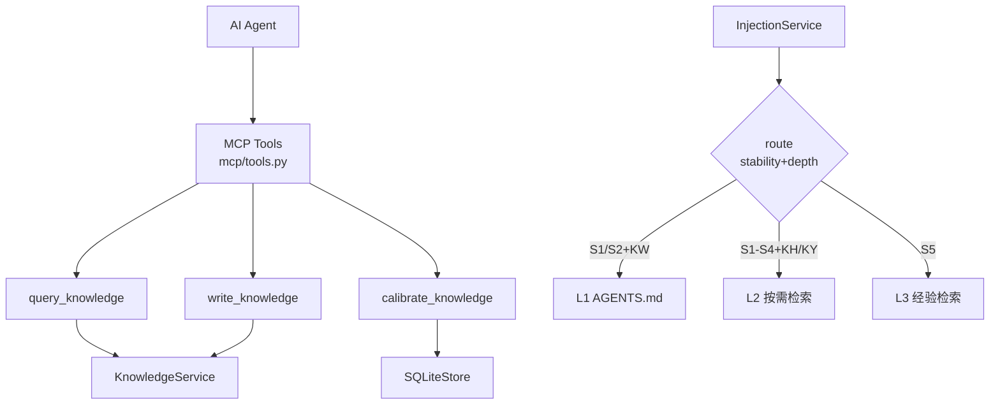

## 产品概述

Phase 8 是 devContextMemo 知识系统的外部接口层实现，目标是提供 MCP Tool 供 AI Agent 检索/写入/校准知识，以及知识注入服务实现三层注入路由（恒常注入/按需检索/经验检索）。基于 V1.1 MCP Tool 接口设计，采用纯函数实现避免外部依赖编译问题。

## 核心功能

- **MCP Tool 1: query_knowledge**：AI 检索知识
  - query（FTS5 搜索）和 id（精确查询）互斥
  - include_full=false 返回 L0 摘要；true 返回完整正文（从 MD 文件读取）
  - 翻页（limit/offset）+ has_more + next_offset
  - next_action 提示（引导 AI 下一步操作）
- **MCP Tool 2: write_knowledge**：AI 写入知识
  - 异步入队语义，返回 task_id + status=accepted
  - content 最大 10000 字符
  - 可选 granularity/stability/depth（系统推断默认值）
- **MCP Tool 3: calibrate_knowledge**：校准知识
  - scope: all / domain:{name} / id:kw-{xxx}
  - mode: quick / full
  - 识别 stale 项（last_calibrated_at 为空或超过 90 天）
- **输入校验**：
  - domain: `^[a-z0-9_-]{1,64}$`
  - scope: `^(all|domain:[a-z0-9_-]{1,64}|id:kw-[a-z0-9-]+)$`
  - limit: 1-20 / offset: ≥0 / content: 0 < len ≤ 10000
- **三层注入路由**：
  - L1 恒常注入：S1/S2 + KW → AGENTS.md（每次会话自动，≤4K tokens）
  - L2 按需检索：S1/S2 + KH/KY, S3/S4 + 任意 → get_knowledge
  - L3 经验检索：S5 + 任意 → get_experience
- **AGENTS.md 草稿生成**：收集 S1/S2+KW 知识，按 Token 截断策略生成

## 技术栈

- Python 3.13+（json / re / pathlib 标准库）
- **纯函数实现**（不依赖 fastmcp，避免 cryptography 编译失败）
- pytest（单元测试）

## 实现方案

### 整体策略（放弃 fastmcp）

原计划使用 fastmcp 框架注册 MCP Tool，但 fastmcp 依赖 cryptography 需要编译，在当前环境编译失败。改为**纯函数实现**：
- Tool 函数接收 `knowledge_service`/`sqlite_store` 实例作为第一参数
- 返回 `ToolResponse` 对象（含 data dict + status）
- 由 `mcp/server.py` 负责将纯函数注册到 MCP 协议（如果需要）
- 测试时直接调用纯函数，无需启动 MCP Server

### query_knowledge 分层返回

```
include_full=false → L0 摘要（id/title/domain/granularity/stability/depth/summary/confidence）
include_full=true  → 完整正文（从 MD 文件读取 frontmatter 之后的 body）
```

### next_action 引导设计

每次响应附带 `next_action` 提示，引导 AI 下一步：
- 有结果 + 非 full → `"use id + include_full=true for full content"`
- 无结果 → `"未找到相关知识，可以尝试扩大搜索范围或添加新知识"`

### 三层注入路由推导

```
S1/S2 + KW → L1（恒常注入，AGENTS.md）
S1/S2 + KH/KY → L2（按需检索）
S3/S4 + 任意 → L2（按需检索）
S5 + 任意 → L3（经验检索）
```

### L1 Token 截断策略（4K 预算）

```
优先级 1: S1-KW（原则级，不可截断）
优先级 2: L0-S2-KW（全局架构，至少 3 条）
优先级 3: L1-S2-KW（领域架构，按校准时效降序）
超出预算 → 截断 + 注释 "<!-- 已截断 N 条知识 -->"
```

## 架构设计



## 目录结构

```
src/devcontext/
├── mcp/
│   ├── __init__.py           # [NEW] 导出
│   ├── tools.py              # [NEW] 3 个 Tool 纯函数 + 校验
│   ├── server.py             # [NEW] MCP Server 入口
│   └── resources.py          # [NEW] MCP Resource 定义
├── services/
│   └── injection.py          # [NEW] 三层注入 + AGENTS.md

tests/
├── unit/
│   ├── test_mcp_tools.py     # [NEW] 3 Tool + 校验 + 翻页
│   └── test_injection.py     # [NEW] 路由 + AGENTS.md + L2/L3
```

## 关键代码结构

### query_knowledge（mcp/tools.py 核心）

```python
def query_knowledge(knowledge_service, *, query=None, id=None,
                    domain=None, depth=None, stability_min=None,
                    limit=None, offset=None, include_full=False) -> ToolResponse:
    # query 和 id 互斥
    if not query and not id:
        raise ValidationError(400, "either query or id is required")
    if query and id:
        raise ValidationError(400, "query and id are mutually exclusive")
    # 参数校验
    _validate_domain(domain)
    limit = _validate_limit(limit)  # 1-20, default 5
    offset = _validate_offset(offset)  # >=0, default 0
    # ID 精确查询
    if id:
        record = knowledge_service.get_by_id(id)
        item = _record_to_item(record, include_full)
        return ToolResponse({"items": [item], "total": 1, ...})
    # FTS5 搜索 + 翻页
    results = knowledge_service.search(query, domain=domain, top_k=limit+offset)
    paginated = results[offset:offset+limit]
    items = [_search_result_to_item(r, include_full) for r in paginated]
    return ToolResponse({"items": items, "has_more": ..., "next_action": ...})
```

### 三层注入路由（services/injection.py 核心）

```python
L1_TOKEN_BUDGET = 4096

class InjectionService:
    @staticmethod
    def route(stability: str, depth: str) -> str:
        if stability in ("S1", "S2") and depth == "KW":
            return LAYER_L1
        if stability in ("S1", "S2", "S3", "S4"):
            return LAYER_L2
        return LAYER_L3  # S5

    def generate_agents_md(self) -> Path:
        # 收集 S1/S2 + KW 知识
        rows = conn.execute(
            "SELECT ... FROM knowledge_index "
            "WHERE status IN ('active','cold') "
            "AND stability IN ('S1','S2') AND depth='KW' "
            "ORDER BY stability ASC, last_calibrated_at DESC"
        ).fetchall()
        # Token 截断
        for row in rows:
            line_tokens = len(line) // 2
            if token_used + line_tokens > L1_TOKEN_BUDGET:
                truncated_count += 1
                continue
            content_lines.append(line)
            token_used += line_tokens
        # 写入草稿
        draft_path = self.knowledge_dir / "staging" / "AGENTS.knowledge.draft.md"
        draft_path.write_text("\n".join(content_lines))
```

## 实现注意事项

- **放弃 fastmcp**：fastmcp 依赖 cryptography 需要 Rust 编译器，当前环境编译失败。改为纯函数实现，Tool 函数接收 service 实例作为第一参数，测试时直接调用
- **query 和 id 互斥**：不能同时提供，也不能都不提供
- **include_full 读取 MD 文件**：从 uri 指向的 MD 文件读取 frontmatter 之后的正文，文件不存在时 source_missing=true
- **write_knowledge 异步语义**：返回 task_id + status=accepted，实际写入由 KnowledgeService.create 同步完成（但对外表现为异步入队）
- **calibrate_knowledge 简化实现**：只检查 last_calibrated_at 是否超过 90 天，不实际调用 LLM 语义对比（完整校准由 CalibrationEngine 负责）
- **L1 Token 估算**：1 中文字 ≈ 1 token，取 `len(line) // 2` 作为折中估算
- **AGENTS.md 草稿路径**：写入 `.devContextMemo/staging/AGENTS.knowledge.draft.md`，人工审核后合并到正式 AGENTS.md
- **L3 仅检索 S5**：经验级知识（极稳定）单独走 L3 通道，与 L2 检索逻辑分离
- **_record_to_item concept_tags 反序列化**：DB 中存 JSON 字符串，响应时 json.loads 转为 list
