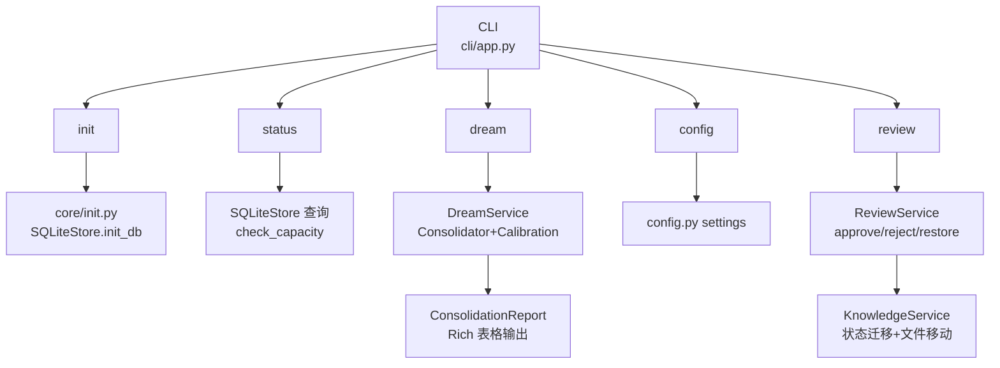

## 产品概述

Phase 9 是 devContextMemo 知识系统的命令行交互层实现，目标是提供用户友好的 CLI 工具完成冷启动、状态查看、审核交互、主动扫描和配置管理。基于 Typer 框架和 Rich 美化输出，将底层 service 能力暴露为命令行接口。

## 核心功能

- **dev init**：冷启动
  - 创建 `.devContextMemo/` 目录结构（staging/knowledge/deprecated/raw/）
  - 初始化 SQLite 数据库（Schema V1.4 全部表 + FTS5）
  - 生成默认配置文件
- **dev status**：知识库状态查看
  - 总数 + 各状态数（staged/candidate/pending_review/draft/active/cold/stale/deprecated）
  - 各领域分布
  - 容量告警（soft 500 / hard 2000）
  - 最近活动
- **dev review**：审核交互
  - `review list`：列出待审核知识（staged/pending_review）
  - `review approve`：批准知识（staged→candidate/pending_review→active）
  - `review reject`：拒绝知识（→deprecated）
  - `review restore`：恢复废弃知识（deprecated→staged）
- **dev dream**：主动扫描（dev dream / 自动每 7 天）
  - 调用 Consolidator 执行巩固（晋升+修剪）
  - 调用 CalibrationEngine 执行校准
  - 输出巩固报告
- **dev config**：配置管理
  - `config get`：读取配置项
  - `config set`：设置配置项（LLM API key/model、仲裁阈值等）

## 技术栈

- Python 3.13+
- Typer（CLI 框架，类型提示驱动）
- Rich（终端美化输出，表格/颜色/进度条）
- pytest + CliRunner（CLI 测试）

## 实现方案

### 整体策略

CLI 作为薄层，仅负责参数解析和输出格式化，业务逻辑委托给 service 层：
- `cli/init.py` → `core/init.py` + `SQLiteStore.init_db`
- `cli/status.py` → `SQLiteStore` 查询 + `pruning.check_capacity`
- `cli/review.py` → `services/review.py ReviewService`
- `cli/dream.py` → `services/dream.py DreamService`
- `cli/config.py` → `config.py settings`

### 命令结构

```
devcontext (Typer app)
├── init                    # 冷启动
├── status                  # 状态查看
├── dream                   # 主动扫描
├── config (Typer sub-app)
│   ├── get                 # 读取配置
│   └── set                 # 设置配置
└── review (Typer sub-app)
    ├── list                # 列出待审核
    ├── approve             # 批准
    ├── reject              # 拒绝
    └── restore             # 恢复
```

### 冷启动目录结构

```
.devContextMemo/
├── knowledge/              # 已采纳知识（按 domain 子目录）
├── staging/                # 待审核知识
├── deprecated/             # 已废弃知识
├── raw/                    # 原始会话 JSONL
├── devcontextmemo.db       # SQLite 数据库
└── config.yaml             # 配置文件
```

### dev dream 流程

```
1. 初始化 Consolidator + CalibrationEngine
2. Consolidator.process() → ConsolidationReport
    - 扫描全表 → V2.1 评分 → 修剪 → 晋升 → 文件移动
3. CalibrationEngine.trigger(E1 git_commit)
    - 查找关联知识 → LLM 语义对比 → 状态更新
4. 输出报告（Rich 表格）
    - promotions / pruned / stale_marked / cold_marked / moved_files / errors
```

## 架构设计



## 目录结构

```
src/devcontext/
├── cli/
│   ├── __init__.py
│   ├── app.py               # [NEW] Typer 实例 + 命令注册
│   ├── init.py              # [NEW] init_command 冷启动
│   ├── status.py            # [NEW] status_command 状态查看
│   ├── config.py            # [NEW] config_get/config_set
│   ├── review.py            # [NEW] review_list/approve/reject/restore
│   └── dream.py             # [NEW] dream_command 主动扫描
├── services/
│   ├── review.py            # [NEW] ReviewService
│   ├── dream.py             # [NEW] DreamService
│   └── pipeline.py          # [NEW] PipelineService
├── core/
│   └── init.py              # [NEW] 冷启动逻辑

tests/
├── unit/
│   ├── test_cli.py          # [NEW] CLI 命令测试
│   └── test_services.py     # [NEW] Service 测试
```

## 关键代码结构

### CLI 命令注册（cli/app.py 核心）

```python
import typer
from devcontext.cli.config import config_get, config_set
from devcontext.cli.dream import dream_command
from devcontext.cli.init import init_command
from devcontext.cli.review import review_approve, review_list, review_reject, review_restore
from devcontext.cli.status import status_command

app = typer.Typer(name="devcontext", help="码上记忆 CLI 工具")

app.command(name="init")(init_command)
app.command(name="status")(status_command)
app.command(name="dream")(dream_command)

config_app = typer.Typer(help="配置管理")
config_app.command(name="get")(config_get)
config_app.command(name="set")(config_set)
app.add_typer(config_app, name="config")

review_app = typer.Typer(help="审核交互")
review_app.command(name="list")(review_list)
review_app.command(name="approve")(review_approve)
review_app.command(name="reject")(review_reject)
review_app.command(name="restore")(review_restore)
app.add_typer(review_app, name="review")
```

### dream_command（cli/dream.py 核心）

```python
def dream_command():
    """主动扫描：巩固 + 校准。"""
    # 初始化 stores
    db = SQLiteStore(db_path)
    md = MarkdownStore(staging, knowledge, deprecated)
    # Consolidator
    consolidator = Consolidator(db, md)
    report = consolidator.process()
    # 输出报告（Rich 表格）
    console.print(f"[green]巩固完成[/green]: {report}")
    console.print(f"  扫描: {report.total_scanned}")
    console.print(f"  晋升: {report.promotions}")
    console.print(f"  修剪: {report.pruned}")
    console.print(f"  STALE: {report.stale_marked}")
    console.print(f"  COLD: {report.cold_marked}")
    console.print(f"  文件移动: {report.moved_files}")
    console.print(f"  错误: {report.errors}")
```

### ReviewService（services/review.py 核心）

```python
class ReviewService:
    def list_pending(self) -> list[dict]:
        """列出待审核知识（staged/pending_review）。"""
        return conn.execute(
            "SELECT * FROM knowledge_index WHERE status IN ('staged','pending_review')"
        ).fetchall()

    def approve(self, knowledge_id: str) -> None:
        """批准知识：staged→candidate / pending_review→active。"""
        record = self.get_by_id(knowledge_id)
        if record["status"] == "staged":
            new_status = "candidate"  # T3
        elif record["status"] == "pending_review":
            new_status = "active"  # 人工批准
        if is_valid_transition(record["status"], new_status):
            self._update_status(knowledge_id, new_status)

    def reject(self, knowledge_id: str, reason: str) -> None:
        """拒绝知识：→deprecated。"""
        self._update_status(knowledge_id, "deprecated", reason)

    def restore(self, knowledge_id: str) -> None:
        """恢复废弃知识：deprecated→staged (T20)。"""
        self._update_status(knowledge_id, "staged")
```

## 实现注意事项

- **CLI 作为薄层**：命令函数只做参数解析 + 调用 service + 格式化输出，不包含业务逻辑
- **Typer 子命令组**：config 和 review 使用 `typer.Typer()` 子应用 + `app.add_typer()` 注册，支持 `dev config get` / `dev review list` 形式
- **Rich 输出美化**：status 用表格、dream 用彩色统计、review list 用表格
- **冷启动幂等**：init_command 检测 `.devContextMemo/` 已存在则跳过或提示，不覆盖已有数据
- **dream 报告输出**：ConsolidationReport 的 to_dict() 转 Rich 表格，含 promotions/pruned/stale/cold/moved/errors
- **review 状态迁移**：approve 时 staged→candidate (T3) / pending_review→active（人工批准），reject 时 →deprecated，restore 时 deprecated→staged (T20)
- **配置文件**：config.yaml 存储 LLM API key/model、仲裁阈值等，config get/set 读写此文件
- **CliRunner 测试**：使用 typer.testing.CliRunner 调用命令，验证退出码和输出
